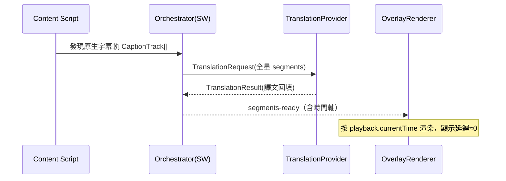
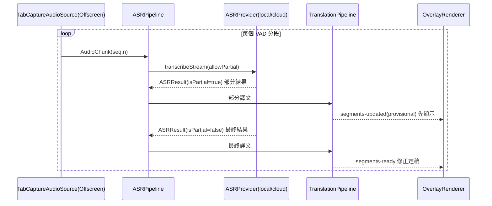
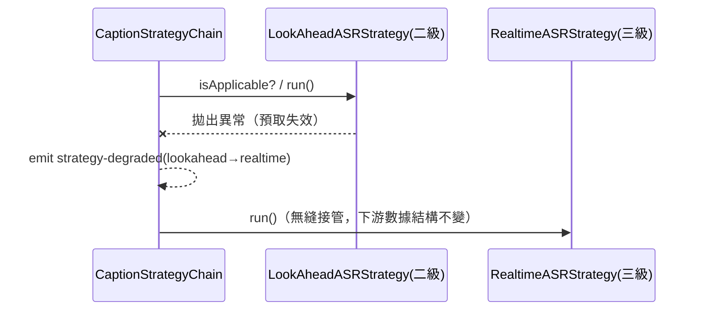

# AI_Trans 系統架構設計文檔

> 版本：v0.1（草案）
> 狀態：架構設計 — 組件劃分、數據結構、接口、實時性分析
> 關聯文檔：`doc/requirements-design.md`
> 最後更新：2026-08-06（§7 補翻譯失敗診斷可見性 F-11：diagnostics 模塊 + lastDiagnostic + Popup 常駐診斷行 + 測試連接按鈕 +「全鏈不適用」診斷 §5.6 + 軌列表三態診斷 `getLastTrackDiagnostic` + Options 保存失敗可見 + M2/M3 佔位診斷；endpoint.ts 抽離）

---

## 1. 概述與設計原則

本文檔在需求設計文檔基礎上，完成**代碼級別的組件/模塊劃分、關鍵數據結構與接口設計**。設計的第一目標是：**將需求分析中識別出的「變化風險點」隔離到可插拔的邊界模塊中**，使得風險發生時，只需**新增/替換適配代碼**，而不需要大範圍改動核心邏輯。

### 1.1 設計原則

| 原則 | 說明 |
|---|---|
| 依賴倒置（DIP） | 核心管線依賴**抽象端口接口**，不依賴具體實現（YouTube、某翻譯 API）。 |
| 關注點分離（SoC） | 字幕來源、ASR、翻譯、渲染、配置各自獨立，互不知曉內部實現。 |
| 面向接口編程 | 所有易變依賴通過接口接入，實現可替換。 |
| 穩定核心 + 可插拔邊緣 | 核心是**穩定的內部數據結構 + 管線**；邊緣是**可插拔適配器**。 |
| 單向依賴 | 依賴方向恆為「適配層 → 領域層」，核心不反向依賴適配器。 |

### 1.2 架構風格

採用 **端口與適配器架構（Hexagonal / Ports & Adapters）**：

- **端口（Port）**：核心對外定義的抽象接口（如「給我音頻」「幫我翻譯」）。
- **適配器（Adapter）**：端口的具體實現（YouTube 音頻源、OpenAI 翻譯、本地 Whisper）。
- **核心（Core）**：只認**內部標準數據結構**，通過端口與外界交互，對具體實現無感。

> 關鍵機制：適配器負責把「外部異構數據」轉換成「內部穩定數據結構」。因此外部變化被吸收在適配器內，核心不受影響。

---

## 2. 變化風險 → 抽象邊界映射（核心章節）

這是本架構的設計主線。下表把需求文檔第 9 節的風險，逐一映射到抽象邊界與插拔方式。

| 變化風險（來自需求文檔） | 抽象邊界（端口接口） | 內部穩定數據結構 | 風險發生時的動作 |
|---|---|---|---|
| YouTube 頁面/接口改版 | `PlatformAdapter` | `PlaybackState` / `CaptionTrack` / `AudioSourceHandle` | 新增/修改一個平台適配器，核心無感 |
| 二級預緩衝方案脆弱 | `AudioSourceProvider` | `AudioChunk` | 替換音頻來源實現；失效時策略鏈降級到三級 |
| 字幕三級策略變化 | `CaptionStrategy`（策略鏈） | `SubtitleSegment` | 插入/移除一個策略節點 |
| 翻譯引擎多樣（LLM/MT/雲/本地） | `TranslationProvider` | `TranslationRequest` / `TranslationResult` | 新增一個翻譯適配器 + 註冊 |
| ASR 引擎多樣（本地/雲端） | `ASRProvider` | `ASRRequest` / `ASRResult` | 新增一個 ASR 適配器 + 註冊 |
| 未來擴展非 YouTube 平台 | `PlatformAdapter` | 同上 | 新增平台適配器 |
| 密鑰/端點/配置變化 | `ConfigStore` + `EngineConfig` | `EngineConfig` | 配置驅動，無需改代碼 |
| 字幕渲染/樣式變化 | `SubtitleRenderer` | `RenderableCue` | 替換渲染器實現 |

> **一句話總結**：外部每一個「會變」的東西，背後都站著一個接口。變化只落在接口的實現上。

---

## 3. 分層架構

```
┌──────────────────────────────────────────────────────────┐
│ 表現層 Presentation                                        │
│   OverlayRenderer（覆蓋層字幕）  Options/Popup（配置界面）  │
├──────────────────────────────────────────────────────────┤
│ 應用層 Application                                         │
│   Orchestrator（調度）  CaptionStrategyChain（策略鏈）     │
│   TranslationPipeline（翻譯管線）  ASRPipeline（識別管線） │
├──────────────────────────────────────────────────────────┤
│ 領域層 Domain（穩定核心）                                  │
│   內部數據結構（Segment/Chunk/...）  端口接口（Ports）     │
├──────────────────────────────────────────────────────────┤
│ 適配層 Adapters（可插拔邊緣）                              │
│   YouTubePlatformAdapter  WhisperASR/CloudASR             │
│   LLMTranslation/MTTranslation  TabCaptureAudioSource     │
├──────────────────────────────────────────────────────────┤
│ 基礎設施層 Infrastructure                                  │
│   MessageBus（消息總線）  ConfigStore（存儲）             │
│   Runtime（SW / Content Script / Offscreen 生命週期）     │
└──────────────────────────────────────────────────────────┘
```

**依賴方向**：上層依賴下層抽象；適配層實現領域層端口；領域層不依賴任何外部。

### 3.1 MV3 運行時分佈

| 層/模塊 | 運行位置 | 原因 |
|---|---|---|
| OverlayRenderer、PlatformAdapter（DOM 交互） | Content Script | 需訪問頁面 DOM 與播放器 |
| Orchestrator、策略鏈、ConfigStore、MessageBus 路由、雲端 API 代理 | Service Worker | 全局調度；SW 為事件驅動，不做長任務 |
| 音頻解碼、本地 Whisper 推理、VAD | Offscreen Document | SW 無法處理音頻/長計算 |
| Options/Popup | 擴充頁面 | 配置 UI |

---

## 4. 端口與適配器

### 4.1 端口清單（核心對外的抽象）

| 端口 | 職責 | 主要實現（適配器） |
|---|---|---|
| `PlatformAdapter` | 提供播放狀態、原生字幕軌、音頻源句柄 | `YouTubePlatformAdapter` |
| `CaptionStrategy` | 一種字幕獲取策略（可串成鏈，支持降級） | `NativeCaptionStrategy` / `LookAheadASRStrategy` / `RealtimeASRStrategy` |
| `AudioSourceProvider` | 提供音頻分塊流 | `TabCaptureAudioSource` / `BufferedAudioSource` |
| `ASRProvider` | 音頻 → 帶時間軸文本 | `LocalWhisperASR` / `CloudASR` |
| `TranslationProvider` | 文本段 → 譯文 | `LLMTranslation` / `MTTranslation` |
| `SubtitleRenderer` | 譯文 + 時間軸 → 屏幕字幕 | `OverlayRenderer` |
| `ConfigStore` | 配置讀寫與變更訂閱 | `ChromeStorageConfig` |
| `MessageBus` | 跨組件消息通信 | `RuntimeMessageBus` |

### 4.2 插拔契約（重要）

每個適配器必須遵守：**輸入/輸出一律使用領域層定義的內部數據結構**。外部格式的轉換（如 YouTube 字幕 XML → `SubtitleSegment`）在適配器內部完成。這是「風險不外溢」的保證。

---

## 5. 組件/模塊劃分（代碼級）

### 5.1 目錄結構草圖

```
src/
├── domain/                      # 領域層：穩定核心，無外部依賴
│   ├── models/                  # 數據結構（見第 6 章）
│   │   ├── subtitle.ts
│   │   ├── audio.ts
│   │   ├── asr.ts
│   │   ├── translation.ts
│   │   ├── playback.ts
│   │   ├── config.ts
│   │   └── events.ts
│   └── ports/                   # 端口接口（見第 7 章）
│       ├── platform-adapter.ts
│       ├── caption-strategy.ts
│       ├── audio-source.ts
│       ├── asr-provider.ts
│       ├── translation-provider.ts
│       ├── subtitle-renderer.ts
│       ├── config-store.ts
│       └── message-bus.ts
│
├── application/                 # 應用層：調度與管線
│   ├── orchestrator.ts          # 總調度
│   ├── caption-strategy-chain.ts# 策略鏈 + 降級
│   ├── asr-pipeline.ts          # 分段 → ASR → 重排
│   ├── translation-pipeline.ts  # 段 → 翻譯 → 兜底
│   └── registry.ts              # Provider/Strategy 註冊表
│
├── adapters/                    # 適配層：可插拔實現
│   ├── platform/
│   │   └── youtube/             # 風險隔離：YouTube 改版只動這裡
│   ├── audio/
│   │   ├── tab-capture-source.ts
│   │   └── buffered-source.ts   # 二級（高風險）
│   ├── asr/
│   │   ├── local-whisper.ts
│   │   └── cloud-asr.ts
│   ├── translation/
│   │   ├── llm-translation.ts
│   │   └── mt-translation.ts
│   └── render/
│       └── overlay-renderer.ts
│
├── infrastructure/              # 基礎設施
│   ├── message-bus.ts
│   ├── config-store.ts
│   ├── vad.ts                   # 語音活動檢測
│   └── perf/                    # 性能觀測（見第 11 章）
│       └── metrics.ts
│
└── runtime/                     # MV3 運行時入口
    ├── service-worker.ts        # 配置路由 SW（manifest "type":"module"，ESM 打包）
    ├── content-script.ts        # SubtitleController：自動掛載 + rAF 渲染 + 熱重啟（IIFE 打包）
    ├── composition.ts           # buildDefaultRegistry（async，依配置選引擎 + 解析 apiKey）
    ├── endpoint.ts              # normalizeEndpoint：端點規範化純函數（零依賴，composition/connection-test 共用）
    ├── offscreen.ts             # M2：音頻/推理
    ├── options/                 # 配置頁（options.ts/html，IIFE）
    └── popup/                   # 彈出頁（popup.ts/html + connection-test.ts 連接測試，IIFE）
```

> **構建打包**：`scripts/build.mjs` 用 esbuild 對 4 個 runtime 入口 bundle。MV3 content script 不支持 `import` 語句，故 content-script/options/popup 打包為 **IIFE**；service-worker 聲明為 module 型（manifest `"type":"module"`），打包為 **ESM**。`scripts/copy-static.mjs` 拷貝 manifest 與頁面 HTML；`TEST_PROFILE=1` 時向 dist manifest 追加 `localhost` match 供 E2E 加載擴充（生產構建保持乾淨）。
>
> **發布件**：`scripts/package-release.mjs`（`npm run release`）在生產構建基礎上，把 `dist/` 中運行必需文件拷入 `release/ai-trans-extension/`（剔除 `.js.map` 與 `.d.ts`、移除 sourcemap 引用註釋），並生成 `release/ai-trans-extension-v<version>.zip`。用戶通過瀏覽器「加載已解壓的擴充程序」選擇該目錄即可使用（三平台一致）。發布件版本須與 `package.json` 的 `version` 一致，改動用戶可見行為後須重新生成——見 AGENTS.md §2 一致性規則。

> **測試依賴的 CI 相容性（實裝經驗）**：集成測試以 **jsdom** 提供 DOM。jsdom 的傳遞依賴必須與 CI 目標 Node 版本相容——`jsdom@30` 依賴的 `undici@8` 在 Node 20 的 import 期即調用 `webidl.util.markAsUncloneable`（該版 Node 未提供）而拋 `TypeError`，令集成測試**收集階段整體崩潰**（0 用例、退出碼 1），並因 `test:ci` 的 `&&` 短路掩蓋 contract/E2E。故 **`jsdom` 鎖定 `^26`**（已移除 undici 依賴），CI Node 固定 20。此類問題只在 CI（真實 Node/Linux）暴露，本地新版 Node 不復現——依賴升級後必須跑 `test:ci` 確認集成用例數非 0，且不可忽視 `npm warn EBADENGINE`。詳見 system-test-design §3.4。

### 5.2 模塊職責與依賴方向

- `domain/*`：只定義類型與接口，**不 import 任何 adapters/infrastructure**。
- `application/*`：import `domain`，通過 `registry` 拿到接口實例，編排流程。
- `adapters/*`：import `domain`（實現端口）；彼此不互相依賴。
- `runtime/*`：組裝（依賴注入）——在啟動時把具體適配器註冊進 `registry`。

> 依賴永遠指向核心。新增一個翻譯供應商，只在 `adapters/translation/` 加文件並在 `runtime` 註冊，`application` 與 `domain` 一行不改。

---

## 6. 關鍵數據結構（TypeScript）

> 這些是**內部穩定數據結構**。所有適配器的輸入輸出都必須轉換成它們——這是風險隔離的落點。

### 6.1 字幕與時間軸

```typescript
/** 統一時間單位：毫秒，相對視頻起點 */
export type Millis = number;

/** 內部標準字幕段——所有字幕來源的統一輸出 */
export interface SubtitleSegment {
  id: string;                 // 穩定 ID，用於去重與更新
  start: Millis;
  end: Millis;
  sourceText: string;         // 原文（ASR 或原生字幕）
  translatedText?: string;    // 譯文（翻譯後回填）
  sourceLang?: string;        // BCP-47，如 "en"
  targetLang?: string;        // BCP-47，如 "zh-Hant"
  origin: CaptionOrigin;      // 來源級別，便於觀測與降級
  provisional: boolean;       // 是否為臨時（可被後續修正）字幕
  revision: number;           // provisional 修正版本號，遞增
}

export type CaptionOrigin = 'native' | 'lookahead-asr' | 'realtime-asr';

/** 平台字幕軌描述（原生字幕發現階段） */
export interface CaptionTrack {
  lang: string;               // 軌語言
  name?: string;              // 顯示名
  isAutoGenerated: boolean;   // 是否自動生成字幕
  fetch(): Promise<SubtitleSegment[]>; // 拉取並轉為內部結構
}
```

### 6.2 音頻

```typescript
/** 內部標準音頻分塊——所有音頻來源的統一輸出 */
export interface AudioChunk {
  seq: number;                // 單調遞增序號，用於重排
  startTime: Millis;          // 對應視頻時間軸的起點
  duration: Millis;
  sampleRate: number;         // 如 16000
  channels: number;           // 通常單聲道 1
  pcm: Float32Array;          // 解碼後 PCM（留在 Offscreen，避免跨域拷貝）
  isSpeech: boolean;          // VAD 結果：是否含語音
}

/** 音頻源句柄：控制音頻流生命週期 */
export interface AudioSourceHandle {
  start(): Promise<void>;
  stop(): Promise<void>;
  readonly kind: 'tab-capture' | 'buffered';
}
```

### 6.3 ASR

```typescript
export interface ASRRequest {
  chunk: AudioChunk;
  hintLang?: string;          // 語言提示（可選）
  allowPartial: boolean;      // 是否允許 provisional 部分結果
}

export interface ASRResult {
  seq: number;                // 對應 AudioChunk.seq，用於重排
  segments: SubtitleSegment[];// 帶時間軸的識別結果（origin=*-asr）
  isPartial: boolean;         // 是否 provisional
  rtf?: number;               // 實時因子（推理耗時 / 音頻時長），觀測用
}
```

### 6.4 翻譯

```typescript
export interface TranslationRequest {
  segments: SubtitleSegment[]; // 待翻譯段（可批量）
  targetLang: string;
  context?: string[];          // 前文，用於連貫性
  streaming?: boolean;         // 是否需要流式返回（低延遲）
}

export interface TranslationResult {
  segments: SubtitleSegment[]; // translatedText 已回填
  engineId: string;            // 實際使用的引擎（觀測/降級記錄）
  degraded: boolean;           // 是否為兜底引擎產出
}
```

### 6.5 播放狀態

```typescript
export interface PlaybackState {
  currentTime: Millis;
  playing: boolean;
  rate: number;                // 倍速
  duration: Millis;
  buffered: Array<{ start: Millis; end: Millis }>; // 供二級判斷可預取範圍
}
```

### 6.6 配置

```typescript
export interface EngineConfig {
  translation: {
    type: 'cloud-llm' | 'local' | 'mt';
    model?: string;
    endpoint?: string;
    apiKeyRef?: string;        // 指向本地安全存儲，不明文散播
    fallbackType?: 'mt' | 'none';
  };
  asr: {
    type: 'local-whisper' | 'cloud';
    modelTier?: 'tiny' | 'base' | 'small';
    endpoint?: string;
    apiKeyRef?: string;
  };
  targetLang: string;
  displayMode: 'mono' | 'bilingual';
  performanceProfile: 'streaming' | 'balanced' | 'quality';
  subtitleStyle?: Record<string, string>;
}
```

### 6.7 管線事件

```typescript
export type PipelineEvent =
  | { type: 'segments-ready'; segments: SubtitleSegment[] }     // 可渲染
  | { type: 'segments-updated'; segments: SubtitleSegment[] }   // provisional 修正
  | { type: 'strategy-degraded'; from: CaptionOrigin; to: CaptionOrigin }
  | { type: 'engine-degraded'; port: 'asr' | 'translation'; reason: string }
  | { type: 'metrics'; data: PerfSample };                      // 見第 11 章
```

---

## 7. 核心接口設計（TypeScript）

> 每個端口附「新增實現時要做什麼」的插拔說明。

### 7.1 PlatformAdapter（隔離 YouTube 改版風險）

```typescript
export interface PlatformAdapter {
  readonly platformId: string;                 // 如 "youtube"
  matches(url: string): boolean;               // 是否適用當前頁面
  observePlayback(cb: (s: PlaybackState) => void): () => void; // 返回取消訂閱
  listCaptionTracks(): Promise<CaptionTrack[]>;// 發現原生字幕軌
  getAudioSource(): Promise<AudioSourceHandle>;// 提供音頻源（含 tabCapture/buffered）
  mountPoint(): HTMLElement;                    // 覆蓋層字幕掛載容器
}
```

**插拔說明**：新增平台 → 新建一個 `PlatformAdapter` 實現並註冊；YouTube 改版 → 只改 `YouTubePlatformAdapter` 內部選擇器/接口解析，其餘不動。

> **content-script 運行時約束（實裝經驗）**：`FetchCaptionSource` 在 content script（isolated world）中拉取 timedtext。直接調用 `window.fetch`（未綁定接收者）會拋 `TypeError: Illegal invocation`——`fetch` 必須以 `window` 為接收者。因此默認 fetch 在構造時 `bind(globalThis)`（LLM 適配器同理）。此外字幕 `baseUrl` 可能為相對路徑（如 Mock 站點），統一以 `new URL(baseUrl, location.href)` 解析為絕對 URL。
>
> **timedtext 格式兼容（M1-40，真實 YouTube 實裝經驗）**：`captionTracks[].baseUrl` 的真實行為與舊測試契約不一致——默認（無 `fmt`）返回 **srv3 XML**（`<timedtext format="3"><body><p t="毫秒" d="毫秒"><s>text</s></p></body>`，子節點為 `p` 非 `text`），也可能是非字幕 HTML（登錄/錯誤/驗證頁）。為兼容，`fetchTracks` 經 `withJson3Format(url)` 對 **YouTube 域名**的 timedtext URL 追加/覆寫 `fmt=json3` 取穩定 JSON（`{"events":[…]}`）；非 YouTube 域名（Mock 站點）原樣不動。JSON 分支優先；若仍回退 XML，`parseXml` 需：① DOMParser 產 `parsererror`（HTML 錯誤頁）→ 拋「parse error (not valid XML…)」**而非誤判「無字幕根」**；② 識別 `<timedtext>` 根含 `<p>` 子節點 → `parseSrv3`（毫秒軸、多 `<s>` 拼接、`decodeEntities` 解 `&#\d+;`/`&amp;`/`&lt;`/`&gt;`/`&quot;`/`&#39;`）；③ 傳統 `<transcript><text>` 秒級軸照舊。
>
> **訂閱/Observer 洩漏**（restart 路徑）：`SubtitleController` 的 `observePlayback` 返回 unsubscribe 必須保存為實例字段並在 `stop()` 調用；`MutationObserver` 等待播放器就緒時須保存 handle 供 stop 中斷，並加 15s 超時避免 Promise 永久懸掛（SPA 導航離開 watch 頁時播放器永不出現）。每次 restart（配置變更）前必須完整清理上一輪全部訂閱/Observer/rAF，否則監聽器線性累積 → 內存洩漏 + CPU 空轉。
>
> **外部 JSON 容錯**：`fetchTrackList` 選擇器優先取具名 `#ytInitialPlayerResponse`，回退掃描內聯腳本時用正則匹配 `ytInitialPlayerResponse = {...}` 賦值，避免 `script:not([src])` 誤匹配頁面首個任意內聯 JS。`JSON.parse` 外部內容必須 try/catch 兜底返回 `[]`，禁止 parse 錯誤冒泡成功能降級誤判。
>
> 覆蓋層由 `SubtitleController` 在播放器容器就緒後掛載，並以 `observePlayback` + `requestAnimationFrame` 對齊 `currentTime` 重繪；注意宿主頁若對掛載容器做 `textContent` 全量覆寫會刪除覆蓋層節點（真實 YouTube 不會，Mock 頁需用獨立子節點顯示占位文本）。詳見 AGENTS.md §5 可靠性紅線八條，專屬回歸測試在 TC-R 系列。

### 7.2 CaptionStrategy（三級策略鏈）

```typescript
export interface CaptionStrategy {
  readonly origin: CaptionOrigin;
  /** 當前視頻是否適用本策略（如是否有原生字幕、是否可預取） */
  isApplicable(ctx: StrategyContext): Promise<boolean>;
  /** 產出字幕流；通過回調推送（支持增量與 provisional 修正） */
  run(ctx: StrategyContext, emit: (e: PipelineEvent) => void): Promise<void>;
  stop(): void;
}

export interface StrategyContext {
  platform: PlatformAdapter;
  playback: () => PlaybackState;
  config: EngineConfig;
  asr: ASRProvider;
  translation: TranslationProvider;
}
```

**插拔說明**：三級策略即三個實現，串成鏈。`isApplicable` 為假則降級到下一策略。新增/調整字幕來源 = 增刪一個策略節點，管線與渲染無感。

### 7.3 AudioSourceProvider（隔離二級高風險）

```typescript
export interface AudioSourceProvider {
  readonly kind: 'tab-capture' | 'buffered';
  open(platform: PlatformAdapter): Promise<AudioSourceHandle>;
  /** 分塊音頻流；VAD 標記後推送 */
  onChunk(cb: (chunk: AudioChunk) => void): void;
}
```

**插拔說明**：二級 `BufferedAudioSource` 若因 YouTube 改版失效 → 上層策略鏈捕獲異常 → 降級到三級 `TabCaptureAudioSource`。二者輸出同為 `AudioChunk`，下游 ASR 管線完全不變。

### 7.4 ASRProvider

```typescript
export interface ASRProvider {
  readonly engineId: string;
  readonly location: 'local' | 'cloud';
  warmup(config: EngineConfig['asr']): Promise<void>;  // 模型預熱/常駐
  transcribe(req: ASRRequest): Promise<ASRResult>;     // 或流式（見下）
  /** 可選：流式部分結果，支持 provisional 字幕 */
  transcribeStream?(req: ASRRequest, emit: (r: ASRResult) => void): Promise<void>;
}
```

**插拔說明**：新增 ASR 供應商 → 實現接口 + 註冊。本地/雲端只是 `location` 不同，管線一視同仁。

### 7.5 TranslationProvider

```typescript
export interface TranslationProvider {
  readonly engineId: string;
  readonly location: 'local' | 'cloud';
  translate(req: TranslationRequest): Promise<TranslationResult>;
  translateStream?(req: TranslationRequest, emit: (r: TranslationResult) => void): Promise<void>;
}
```

**插拔說明**：LLM 與 MT 均實現此接口。混合策略在 `TranslationPipeline` 中組合：主用 LLM，失敗/超時降級 MT（見第 10 章）。

> **本地 LLM 服務兼容（F-10，實裝經驗）**：`LLMTranslationProvider` 同時服務雲端與本地 OpenAI 兼容服務（mlx/omlx/LM Studio/Ollama）。三個實裝要點：
> 1. **端點規範化**：組裝時（`composition.ts` 的 `normalizeEndpoint`）兼容兩種填法——已含 `/chat/completions` 的完整路徑原樣保留；含 `/v{n}` 版本段（如 `http://127.0.0.1:8000/v1`）補 `/chat/completions`；裸 host 補 `/v1/chat/completions`；空值回落 OpenAI 默認端點。避免用戶填 Base URL 卻直接 POST 到 `/v1` 得 404。
> 2. **reasoning `<think>` 剝離**：`stripReasoning` 在解析 `content` 前移除成對 `<think>...</think>`、殘留單邊標籤與前導空白。OpenAI 規範把思考放 `reasoning_content`（我們只讀 `content` 本不受影響），但部分本地 MLX 服務把 `<think>` 直接塞進 `content`，不剝離會污染 `ID<TAB>譯文` 行解析。
> 3. **超時降級**：`timeoutMs`（默認 30_000）配 `AbortController`，reasoning 模型單次思考可能 30~40s，超時後拋錯，交由 `TranslationPipeline` 降級 MT 兜底（`finally` 清 timer，避免定時器洩漏——呼應 §7.1 R4）。本地 host 需 `manifest.json` 的 `host_permissions` 含 `http://127.0.0.1/*` 與 `http://localhost/*`。

### 7.6 SubtitleRenderer / ConfigStore / MessageBus

```typescript
export interface SubtitleRenderer {
  mount(container: HTMLElement, style?: Record<string, string>): void;
  render(cues: RenderableCue[], currentTime: Millis): void; // 按當前播放時間渲染
  updateProvisional(cue: RenderableCue): void;// 臨時字幕原地更新
  unmount(): void;
}

export interface RenderableCue {
  id: string;
  sourceText?: string;
  translatedText: string;
  provisional: boolean;
  start: Millis;               // 用於按 currentTime 選段
  end: Millis;
}

export interface ConfigStore {
  get(): Promise<EngineConfig>;
  set(patch: Partial<EngineConfig>): Promise<void>;
  subscribe(cb: (c: EngineConfig) => void): () => void;
}

/** API 密鑰安全存儲：與 EngineConfig 分離，密鑰不明文入配置對象。 */
export interface ApiKeyStore {
  getApiKey(slot: 'llm' | 'asr'): Promise<string | undefined>;
  setApiKey(slot: 'llm' | 'asr', value: string): Promise<void>;
}

export interface MessageBus {
  publish<T>(topic: string, payload: T): void;
  subscribe<T>(topic: string, cb: (payload: T) => void): () => void;
}
```

**ApiKeyStore 說明**：`EngineConfig.translation.apiKeyRef` 僅為「密鑰存在性標記」，實際密鑰值存於獨立 storage key（`engineConfigKeys`），由 `ApiKeyStore` 讀寫。`ChromeStorageConfigStore` 同時實現 `ConfigStore` 與 `ApiKeyStore`。組裝時 `buildDefaultRegistry`（async）從 `ApiKeyStore.getApiKey` 解析密鑰注入 LLM 適配器，密鑰不隨配置對象散播。

> **跨上下文配置熱重啟（F-10，實裝經驗）**：Options 頁與 Content Script 各自持有獨立的 `ChromeStorageConfigStore` 實例，`store.subscribe` 只通知**本進程內**的回調——Options 保存配置後 content-script 收不到通知。因此 `SubtitleController` 改用 **`chrome.storage.onChanged.addListener`**（監聽 local area 的 `engineConfig` / `engineConfigKeys` 兩個 key），配置一變即觸發 `restart()` 完成熱重載；`unsubscribeConfig` 相應改為 `removeListener`。這也保證 `engineConfigKeys`（密鑰）變更同樣觸發重啟。詳見 AGENTS.md §5 R4 與 system-test-design TC-R8。

> **翻譯失敗診斷可見性（F-11，實裝經驗）**：翻譯降級/錯誤事件（`engine-degraded` / `pipeline-error`）此前在 content-script 的 `onEvent` 被靜默忽略——只處理 `segments-*`，其餘事件丟棄。結果：LLM 請求失敗（模型名不符 → omlx 回 `404 Model not found`；或端點錯誤；或網絡層失敗）被管線降級到 MT 兜底後，用戶只見字幕不動、無任何可見線索。（注：曾疑 HTTPS 頁面 mixed-content 攔截本地 `http://127.0.0.1`，但實測 Chrome 對 `localhost`/`127.0.0.1` 明文 HTTP 有豁免，請求正常送達；診斷面反而定位到真實根因是模型名 404。）
> 
> 新增 `src/infrastructure/diagnostics.ts` 承載診斷職責（純邏輯，可單測）：
> - `extractDiagnostic(event)`：從 `engine-degraded`（僅 `translation`/`asr` 端口，策略級 `strategy-degraded` 屬正常流轉不計）與 `pipeline-error` 提取人類可讀原因；`pipeline-error.cause` 若為 `Error` 保留 `name: message`（如 `LLM translation failed: HTTP 404`）。
> - `recordDiagnostic(event)`：寫入 `chrome.storage.local['lastDiagnostic']`（`{ kind, timestamp, message }`）並 `console.warn('[AI_Trans] translation degraded: …')`。§5.7：`chrome.storage.set` 以 try/catch 守護，寫入失敗不影響主流程；console 麵包屑不受存儲失敗影響。
> - `readLastDiagnostic()` / `formatDiagnostic()`：Popup 讀取並渲染「最近失敗」行。
> 
> content-script `onEvent` 在非 `segments-*` 分支 `void recordDiagnostic(e)`（異步不阻塞事件處理）。Popup 翻譯狀態行本地模式並顯示實際生效模型名，用於辨識「保存未生效 / 載入舊版插件」導致的舊配置殘留。
> 
> **Popup「最近失敗」行常駐顯示**（F-11 改進）：不再有記錄才顯示、無記錄整行隱藏——否則「看不到行」會被誤認為 bug。現常駐一行，無記錄顯示「最近失敗: 無」。
> 
> **Popup「測試連接」按鈕**（F-11 新增，`src/runtime/popup/connection-test.ts`）：一鍵向配置端點發最小 `POST /chat/completions`（`messages:[{role:'user',content:'ping'}]`、`max_tokens:1`、`temperature:0`），驗證三件事——端點可達（排除 mixed-content/端口/CORS/連接失敗）、模型存在（HTTP 200 vs 404 Model not found）、響應結構有效（含 `choices[].message.content`）。成功標綠、失敗標紅並顯示原因（含伺服器 error.message、超時、網絡錯誤）。與真實翻譯路徑共用 `normalizeEndpoint`，保證「測試的就是實際會發的請求」。popup 位於擴充上下文且有 `http://127.0.0.1/*`/`http://localhost/*` host_permissions，直接 fetch 即可（無需 SW 代理）。實作規範：`fetchFn = globalThis.fetch.bind(globalThis)`（§5.1 綁定）；超時用 `AbortController` + `finally` 清 timer（§5.4 無洩漏）。
> 
> **`normalizeEndpoint` 抽離為獨立模組**（`src/runtime/endpoint.ts`）：原位於 `composition.ts`（依賴整個 registry 組裝鏈），Popup bundle 引用會連帶打包 adapters/application，故抽為**零依賴純函數**——`composition.ts`（建構 LLM provider）與 `connection-test.ts`（驗證請求）共用，保持行為唯一來源。測試落點 `test/integration/composition.test.ts`（五態）與 `test/integration/connection-test.test.ts`。
>
> **「全鏈不適用」診斷（§5.6 對齊，F-11 改進）**：此前 `NativeCaptionStrategy.isApplicable` 內 `listCaptionTracks` 失敗/為空被 `catch { return false }` 靜默吞掉，`CaptionStrategyChain` 對 `isApplicable=false` 只壓入 errors 數組不發事件——「字幕軌抓不到」與「翻譯失敗」無法區分，診斷行恆為「無」。改進：(1) `StrategyContext` 新增可選 `diagnostics?: string[]` 累加器；(2) `NativeCaptionStrategy.isApplicable` 把軟失敗原因（空軌 / 抓取異常詳情）寫入其中；(3) `CaptionStrategyChain` 全鏈無策略接管時統一發 `pipeline-error`（code `no-caption-strategy`，cause 為 Error 且 message 含各策略診斷，以 ` | ` 連接）→ content-script `recordDiagnostic` → popup 顯示真實原因。測試：單元 `caption-strategy-chain.test.ts`（全鏈診斷 2）+ `native-caption-strategy.test.ts`（軌抓取診斷 4）。
>
> **軌列表三態診斷（M1-39，F-11 細化）**：`fetchTrackList` 返回空數組必須能區分**三個根因**——(a) 找不到數據源 JSON（`#ytInitialPlayerResponse` 缺失/為空）、(b) 外部 JSON 解析失敗（§5.7 不冒泡但不得誤判「無字幕」）、(c) 確實無字幕軌（`captionTracks` 結構不存在）。實現：`FetchCaptionSource` 增 `lastTrackDiagnostic` 字段，三態分別寫入 `player response JSON not found (…)` / `player response JSON parse failed: …` / `player response has no captionTracks (…)`，經新增端口方法 `getLastTrackDiagnostic()`（可選，`YouTubePlatformAdapter` 轉發）暴露；`NativeCaptionStrategy` 空軌時把平台診斷帶入 `ctx.diagnostics`（`native: no caption tracks found — <平台診斷>`），使全鏈失敗 cause 能解釋「為什麼」。另（§5.6 收口）：Options `save()` 保存失敗顯示錯誤狀態（不靜默）；M2/M3 佔位策略 `isApplicable` 寫入 `not implemented (M2/M3)` 診斷——「未實現（預期跳過）」與「真失敗」可區分。測試：集成 `platform-adapter.test.ts`（三態 4）+ 單元 `placeholder-strategies.test.ts`（3）+ `native-caption-strategy.test.ts`（+1 平台診斷帶入）。

---

## 8. 數據流時序

### 8.1 一級：原生字幕



### 8.2 三級：實時擷取 ASR（3~5s，provisional）



### 8.3 降級切換（策略鏈 / 引擎兜底）



---

## 9. 註冊與插拔機制

### 9.1 註冊表

```typescript
export interface Registry {
  platforms: PlatformAdapter[];
  strategies: CaptionStrategy[];              // 有序，代表降級優先級
  asr: Map<string, ASRProvider>;
  translation: Map<string, TranslationProvider>;
  renderer: SubtitleRenderer;
}
```

- 選擇邏輯**由配置驅動**：`Orchestrator` 依 `EngineConfig` 從註冊表挑選具體實現。
- 平台由 `matches(url)` 命中；策略由 `isApplicable` + 順序決定；引擎由 `engineId` 選中。

### 9.2 新增適配器的標準三步

1. **實現接口**：在 `adapters/` 對應目錄新建文件，實現目標端口，輸入輸出使用內部數據結構。
2. **註冊**：在 `runtime/*` 啟動組裝處把實例加入 `Registry`。
3. **配置**：在 Options 暴露選項（或默認選擇），`EngineConfig` 帶上對應 `type`/`engineId`。

> 全程不改 `domain` 與 `application`。這正是「風險發生可快速插入適配代碼」的落地方式。

---

## 10. 錯誤處理與降級策略

### 10.1 統一錯誤模型

```typescript
export interface PipelineError {
  port: 'platform' | 'audio' | 'asr' | 'translation' | 'render';
  code: string;
  recoverable: boolean;
  cause?: unknown;
}
```

### 10.2 降級規則

| 失敗點 | 降級動作 |
|---|---|
| 原生字幕不可用 | 策略鏈降級：native → lookahead → realtime |
| 二級預取失效 | 降級到三級實時擷取（`AudioChunk` 一致，下游無感） |
| 本地 ASR 過慢/失敗 | 依配置切雲端 ASR，或降低模型檔位 |
| LLM 翻譯超時/超額 | 兜底 MT，`TranslationResult.degraded=true` 標記 |
| tabCapture 無授權 | 提示用戶手勢授權；退回原生字幕（若後補可用） |

> 所有降級都發 `PipelineEvent`，供觀測與 UI 提示，且不破壞內部數據契約。

---

## 11. 實時性分析

本章回答兩個問題：**這樣的架構能否滿足性能要求？如何把性能提到最優？**

### 11.1 實時性目標（SLO / 延遲預算）

| 級別 | 字幕來源 | 感知延遲目標 | 說明 |
|---|---|---|---|
| 一級 | 原生字幕 | ≈ 0 | 可全量預翻譯，播放前已就緒 |
| 二級 | 預緩衝提前處理 | ≈ 0（領先播放頭） | look-ahead，只要處理速度快於播放 |
| 三級 | 實時擷取 ASR | **3~5s（P95）** | 固有滯後，靠 provisional 壓低感知延遲 |

### 11.2 端到端延遲鏈

三級單段字幕的顯示滯後由以下環節串起：

```
T_display ≈ T_segment(VAD等待) + T_asr(識別) + T_translate(翻譯) + T_transport + T_render
```

- `T_segment`：VAD 分段等待，取決於分段窗口（如 1~2s）。
- `T_asr`：ASR 推理，= 音頻時長 × RTF（實時因子）。
- `T_translate`：翻譯推理（LLM 較大，MT 較小）。
- `T_transport + T_render`：組件間傳輸 + DOM 渲染，數十毫秒級。

### 11.3 管線數學（關鍵結論）

- **一級**：全量預翻譯，`T_display ≈ 0`。**天然最優。**
- **二級（look-ahead）**：設 ASR 實時因子 `RTF_asr < 1`，則處理速度快於播放，字幕永遠**領先**播放頭 → **感知延遲 ≈ 0**。這是把「實時」轉為「提前」的核心。
- **三級（實時擷取）**：字幕必然滯後，下限為 `T_asr + T_translate`（VAD 窗口可與播放重疊、傳輸渲染可忽略）。**流水線化能提升吞吐（避免越積越多），但不能消除單段固有滯後。**

> 推論：三級要達標，**優化重心是壓低單段 `T_asr + T_translate`，而非單純加並發**。並發解決「跟不上」，不解決「每段慢」。

### 11.4 架構能否滿足實時性（判定）

**能，前提是把性能作為跨切面關注點在架構中內建，而非事後補救。** 本架構已具備的支撐：

| 架構特性 | 對實時性的作用 |
|---|---|
| Offscreen 計算隔離 | 重推理不阻塞頁面/渲染線程 |
| 管線化 + `seq` 重排 | 跨段並發處理，亂序結果按序重排 |
| provisional 字幕（`revision`） | 先顯示部分結果，感知延遲趨近 `T_asr` 首字時間 |
| 策略鏈提前處理（一/二級） | 把實時處理轉為提前處理，感知延遲≈0 |
| 引擎可插拔 + 配置檔位 | 依硬件動態選小模型/雲端，控制 `T_asr` |

**邊界條件（不滿足時觸發降級）**：低端設備上本地 `RTF_asr ≥ 1`（跟不上），此時自動降檔（tiny）或切雲端 ASR；仍不達標則退回「僅原生字幕」。

### 11.5 性能最優化策略（按延遲鏈逐環）

1. **延遲遮蔽（最高槓桿）**
   - 一級全量預翻譯；二級 look-ahead 領先播放頭；三級啟用 provisional 首屏先顯示、後修正。
2. **計算優化（壓 `T_asr`）**
   - WebGPU 加速；模型量化（int8/fp16）；模型檔位（tiny/base/small）；`warmup()` 預熱常駐，消除首次加載抖動。
3. **翻譯優化（壓 `T_translate`）**
   - LLM 流式輸出；短段合批減少往返；低延遲檔位優先 MT。
4. **管線並行**
   - 跨段並發 ASR/翻譯；`seq` 有序重排；背壓與**丟段策略**（落後過多時跳幀保實時，寧可漏一段不積壓）。
5. **傳輸優化**
   - 音頻 PCM 全程留在 Offscreen，不跨組件拷貝；必要傳輸用 Transferable/SharedArrayBuffer；消息合批。
6. **渲染優化**
   - 單一覆蓋層節點增量更新；`requestAnimationFrame` 與播放時間對齊；provisional 原地替換避免重排。
7. **動態引擎選擇**
   - 依 `metrics` 實測 RTF 與延遲自動切檔（品質→延遲降級階梯：LLM→MT、small→tiny、local→cloud）。
8. **觀測（優化前提）**
   - 每階段計時、RTF、丟段數、P50/P95 延遲，經 `PipelineEvent.metrics` 上報。

```typescript
export interface PerfSample {
  stage: 'segment' | 'asr' | 'translate' | 'render';
  ms: number;
  seq?: number;
  rtf?: number;
  dropped?: boolean;
}
```

### 11.6 性能檔位（Profiles）

| 檔位 | ASR 模型 | 翻譯引擎 | provisional | 適用 |
|---|---|---|---|---|
| `streaming` | tiny（WebGPU） | MT 優先/LLM 流式 | 開 | 低延遲優先，弱硬件 |
| `balanced` | base | LLM + MT 兜底 | 開 | 默認 |
| `quality` | small | LLM | 關 | 準確優先，強硬件/雲端 |

### 11.7 驗證方法與指標

- **離線基準**：固定音頻樣本測各檔位 RTF 與準確率。
- **端到端**：注入已知時間軸音頻，測字幕顯示延遲 P50/P95。
- **硬件矩陣**：高/中/低端 × 本地/雲端 × 三檔，確認降級閾值。
- **達標判據**：三級 P95 顯示延遲 ≤ 5s；本地檔位 `RTF < 1`；丟段率在可接受範圍。

---

## 12. 與 MVP 里程碑映射

| 里程碑 | 落地的適配器/模塊 | 先定義後實現的接口 |
|---|---|---|
| M1 原生字幕 | `YouTubePlatformAdapter`、`NativeCaptionStrategy`、`LLMTranslation`/`MTTranslation`、`OverlayRenderer`、`ChromeStorageConfig`；`normalizeEndpoint`（端點規範化）、`stripReasoning`（reasoning 剝離）、LLM 超時降級、`storage.onChanged` 熱重啟（F-10 本地 LLM 兼容） | 全部端口先定義 |
| M2 實時 ASR | `TabCaptureAudioSource`、`LocalWhisperASR`/`CloudASR`、`RealtimeASRStrategy`、VAD、`perf/metrics` | ASR 流式接口啟用 |
| M3 預緩衝 | `BufferedAudioSource`、`LookAheadASRStrategy` | 復用 M2 管線，僅換音頻源 |
| M4 優化 | 動態引擎選擇、性能檔位、樣式與多語言加固 | — |

> M1 即定義**全部端口接口**，後續里程碑只是不斷「新增適配器實現」。這保證了風險發生時的可插拔性從第一天起就成立。

---

## 13. 開放問題（架構層面）

1. **SharedArrayBuffer 可用性**：跨源隔離（COOP/COEP）在擴充上下文的可行性，影響音頻零拷貝方案。
2. **Offscreen 單例限制**：MV3 同時只允許一個 Offscreen 文檔，本地 ASR 與音頻解碼需在同一文檔內協調資源。
3. **本地模型分發**：Whisper 權重體積與加載時機（首次下載/按需），與 `warmup` 策略配合。
4. **流式翻譯的一致性**：LLM 流式與 provisional 字幕修正如何協同，避免抖動。
5. **丟段策略閾值**：落後多少觸發丟段，需結合真機數據標定。
6. **雲端供應商抽象粒度**：是否統一到 OpenAI 兼容端口，降低適配器數量。
