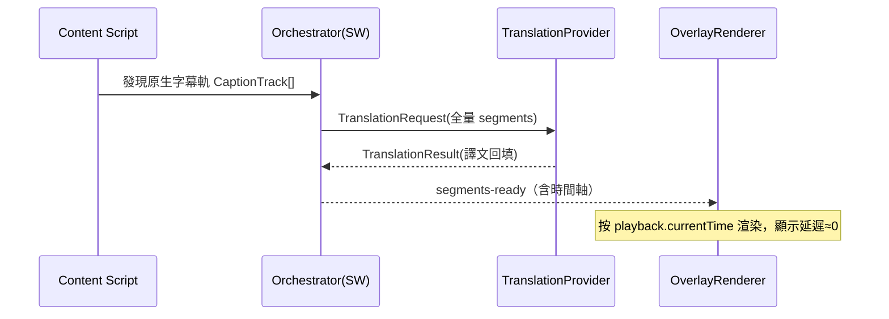
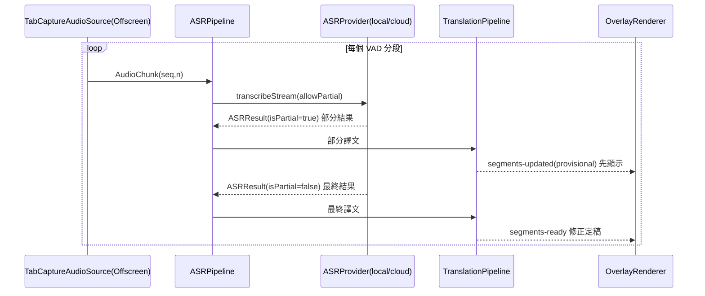
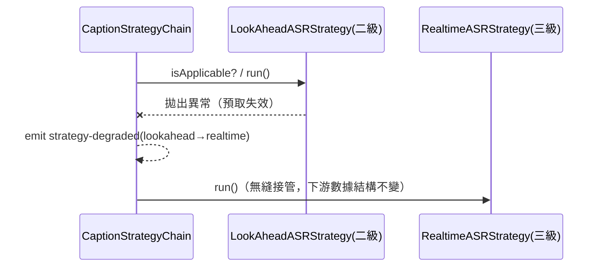

# AI_Trans 系統架構設計文檔

> 版本：v0.1（草案）
> 狀態：架構設計 — 組件劃分、數據結構、接口、實時性分析
> 關聯文檔：`doc/requirements-design.md`
> 最後更新：2026-08-18（**補充修復十二：timedtext 空響應（pot 防護）主動重驅動**：真實環境「重新加載插件後完全無字幕」根因——播放器先發無 pot 請求 → YouTube 返回空 body（`length:0, text/html`）→ 攔截器 skip；播放器**稍後**才內部用 pot 重試，但 `ensureCaptionModuleLoaded` 選軌後**固定 3 秒復位** `setOption('captions','track',{})`（M1-48 抑制原生字幕所加）打斷了尚未完成的 pot 重試鏈 → 播放器永不再發第二次請求 → `waitForCapture(15s)` 超時 → 直接 fetch（無 pot）空 body → native 全鏈失敗。修復：①空響應視為「需要 pot」信號——`emitCapture` 空響應分支排程 `schedulePotRedrive()`（2s 間隔、上限 6 次），切換軌 off→on（先復位再重選，YouTube 對重複 setOption 可能 no-op）逼播放器重發帶 pot 的請求；②復位語義反轉——移除固定 3s 復位，改為「成功捕獲後 ~800ms 抑制原生字幕」（`scheduleSuppressNative`）+ 10 秒截止復位（`scheduleSuppressDeadline`，捕獲失敗時保留原生英文字幕而非全空）；③成功捕獲/video-changed 時 `resetPotRedrive()` 重置計數並取消排程；④調試全局 `__aiTransTimedtextEmptyResponses`/`__aiTransPotRedriveAttempts`。測試 +5（interceptor）。先前：**補充修復十一：local-onnx 輸出回顯原文 + 消息形狀不匹配**：主引擎 local-onnx、模型已下載，字幕仍雙語兩行相同英文、零翻譯錯誤日誌。根因：①消息 shape 不匹配——provider 發 `payload:{text}`、Offscreen 兩入口讀頂層 `msg.text` → 推理收到空文本；②純文本指令對 Qwen2.5-0.5B 遵循度極低 + `max_new_tokens:96` 太短 → 模型回顯原文當「譯文」（成功故無錯誤）。修復：消息統一 payload 優先 + port 通道建立時 direct 入口跳過（防雙重推理）；`buildPrompt` 改 ChatML + 行號標記 + 目標語言 few-shot（Qwen 全系列 ChatML 兼容，換大模型單點改動）；`parseNumberedOutput` 行號對齊 + 全回顯標記 `local-onnx-echo-output` 診斷；`max_new_tokens:256` + `repetition_penalty:1.1`；provider `CHUNK_SIZE=5` 分塊；空譯文回退原文；manifest WAR 加 `src/runtime/ort/*`（content-script 宿主頁面 fetch 擴充資源需 WAR，補充修復七只改 wasmPaths 漏 WAR）。先前：**補充修復九：本地 ONNX 推理失敗診斷可讀化 + 模型載入彈性化**：模型「已就緒」後播放仍雙語兩行英文——Offscreen 顯示模型載入成功（`model ready`）後推理拋 `Error: 1835858576`（ORT wasm 層**數字型**錯誤碼）。修復：`offscreen.ts` 抽共享 `loadPipeline()`（統一 env：`logLevel='info'` 輸出 `[ort]` 初始化/推理日誌、`wasmPaths` 本地化、**numThreads 交由 transformers.js 自決**——Offscreen 無 `crossOriginIsolated` 自動降 1）與 `ensurePipelineLoaded()`（並發安全）；`runInference` **lazy 載入**（Offscreen 重啟後從 Cache API 快取自動恢復，無需重新下載）；`checkModelStatus`/`hasModelInCache` 改用 **Cache API**（transformers.js v3 快取在 Cache API 而非 IndexedDB，且不依賴內存 `translationPipeline`）；`toReadableError` 診斷保留 code/stack（數字型錯誤碼可讀化）；生成參數簡化（貪婪解碼、`max_new_tokens` 128→96）；`LocalONNXTranslationProvider` 增 `isPrimary`（主引擎成功不誤發 engine-degraded）。先前：**補充修復八：local-onnx 可作為主翻譯引擎**：本地 ONNX 模型下載就緒後雙語仍兩行英文——根因：`TranslationConfig.type` 僅 `cloud-llm/local/mt`，local-onnx 只能當 fallback；MT 字典替換永不拋錯被判「成功」→ fallback 永不觸發。修復：`type` 增 `'local-onnx'`，Orchestrator primary 選擇、composition 註冊條件（`type==='local-onnx' || fallbackType==='local-onnx'`）、Options 下拉、popup 顯示同步。**譯文=原文的降級根源**：字典/佔位引擎「成功但未翻譯」不被管線識別，離線引擎須可直接作 primary；先前：**補充修復七：LocalWhisperASR WASM 本地化（content-script 宿主 CSP 阻擋 CDN）**：本地 ONNX 翻譯已就緒、字幕仍僅原文（雙語兩行英文）——YouTube 頁面報 `LocalWhisperASR warmup failed: no available backend found ... jsep.mjs`，CSP 違規：`Loading the script 'https://cdn.jsdelivr.net/...' violates ... "script-src 'self' 'wasm-unsafe-eval' ..."`。根因：先前只對 Offscreen（翻譯模型）做 wasm 本地化，content-script 的 LocalWhisperASR 未設 `wasmPaths`，仍走 jsdelivr CDN；content-script 運行於 **YouTube 頁面環境**，宿主 CSP 攔所有外部 script。修復：`LocalWhisperASR.warmup()` 動態導入 transformers.js 後設 `env.backends.onnx.wasm.wasmPaths = chrome.runtime.getURL('src/runtime/ort/')`（與 Offscreen 同源）。**教訓**：凡 transformers.js pipeline 執行環境（Offscreen 與 content-script）都必須設 `wasmPaths` 指向擴充內資源；content-script 的 CSP 屬宿主頁面，外部 CDN script 一律被攔；先前：**補充修復六：MV3 擴充頁面 CSP 需 `wasm-unsafe-eval`**：jsep 打包後仍失敗，Offscreen 報 `WebAssembly.instantiateStreaming() ... violates "script-src 'self'"` → `no available backend found`——MV3 擴充頁面默認 CSP 不含 wasm 編譯許可。修復：`manifest.json` 添加 `content_security_policy.extension_pages: "script-src 'self' 'wasm-unsafe-eval'; object-src 'self';"`；先前：**補充修復五：onnxruntime-web 需 jsep 變體**：wasm 本地化後仍失敗，Offscreen 報 `no available backend found ... Failed to fetch dynamically imported module: .../ort-wasm-simd-threaded.jsep.mjs`——onnxruntime-web v1.22 初始化 wasm backend 時 dynamic import **jsep 變體**（`ort-wasm-simd-threaded.jsep.{mjs,wasm}`），先前只打包非 jsep 致 404。`copy-static.mjs` 改為打包 jsep + 非 jsep 共 4 個文件（`src/runtime/ort/`）；先前：**補充修復四：ONNX WASM 本地化（CDN 不可達）**：模型可下載、進度 100% 後 Options 狀態卻顯示「下載失敗」。根因：transformers.js v3.8.1 默認 `wasmPaths = https://cdn.jsdelivr.net/npm/@huggingface/transformers@3.8.1/dist/`（onnx.js:211），模型文件（HF）下載完後創建 InferenceSession 需從 jsdelivr 拉取 `.wasm`——網絡不可達 → `pipeline()` 拋錯 → `ok:false`。修復：`copy-static.mjs` 拷貝 `node_modules/onnxruntime-web/dist/ort-wasm-simd-threaded.{wasm,mjs}` 到 `dist/src/runtime/ort/`，`offscreen.ts` 設置 `env.backends.onnx.wasm.wasmPaths = chrome.runtime.getURL('src/runtime/ort/')`（MV3 默認 CSP `'self'` 允許擴充頁面同源載入 wasm/module worker，無需改 manifest）；先前：**補充修復三：本地 ONNX 模型改用公開版（gated 401）**：原模型 `onnx-community/Qwen2.5-0.5B-Instruct-onnx-web` 為 gated（HF 401 需 Token），transformers.js v3.8.1 無法注入 Token，改用公開模型 `onnx-community/Qwen2.5-0.5B-Instruct` + pipeline `dtype: 'q4'`（INT4 `onnx/model_q4.onnx` ~350MB）；先前：**M2-24 本地 ONNX 翻譯兜底（F-14）**：§7.5 新增 `LocalONNXTranslationProvider` 適配器文檔——當雲端 LLM API 失敗時自動降級至本地 ONNX 小模型（`onnx-community/Qwen2.5-0.5B-Instruct`，約 350MB）進行翻譯。架構：content-script → Service Worker → Offscreen Document（`@huggingface/transformers` pipeline + IndexedDB 快取）。新增 `local-onnx:*` 消息協議（check-status/download/clear-cache/translate）。Options UI 新增「本地兜底模型」分區（狀態標籤 + 進度條 + 下載/清除按鈕）。`TranslationConfig.fallbackType` 新增 `'local-onnx'` 選項，降級鏈路：`local-onnx > mt > undefined`）；先前：2026-08-10（**M2-17/M2-18 治理回填**：§7.1 補 M2-17 CSP 違規修復（`new Function` → 直接 import）+ M2-18 ASR warmup 模塊解析（external 方案推翻 → esbuild 打包 transformers 進 IIFE）+ M2-18 字幕攔截器 DOM 解析（`getCaptionTracksFromPlayerResponse()` 首要來源兜底 `getOption` 空陣列）；§12 里程碑映射增列 M2-16/17/18）；先前：回填治理缺口 M1-48/M1-49/M1-50；§7.5 補 M1-48 LLM 直接 fetch 架構、§7.6 補 M1-49/M1-50、§12 增列 M1-48/49/50；§5.1 目錄樹補 `debug-log.ts`、§6.6 補調試日誌門控（F-12/M1-51）；§7.5 補 F-13/M1-52 分塊翻譯 + M1-53 兩階段超時；先前：M1-41/M1-42/M1-43/M1-45/M1-46/M1-47）））

---

## 1. 概述與設計原則

本文檔在需求設計文檔基礎上，完成**代碼級別的組件/模塊劃分、關鍵數據結構與接口設計**。設計的第一目標是：**將需求分析中識別出的「變化風險點」隔離到可插拔的邊界模塊中**，使得風險發生時，只需**新增/替換適配代碼**，而不需要大範圍改動核心邏輯。

### 1.1 設計原則

| 原則 | 說明 |
|---|---|
| 依賴倒置（DIP） | 核心管線依賴**抽象端口接口**，不依賴具體實現（YouTube、某翻譯 API）。 |
| 關注點分離（SoC） | 字幕來源、ASR、翻譯、渲染、配置各自獨立，互不知曉內部實現。 |
| 面向接口編程 | 所有易變依賴通過接口接入，實現可替換。 |
| 穩定核心 + 可插拔邊緣 | 核心是**穩定的內部數據結構 + 管線**；邊緣是**可插拔適配器**。 |
| 單向依賴 | 依賴方向恆為「適配層 → 領域層」，核心不反向依賴適配器。 |

### 1.2 架構風格

採用 **端口與適配器架構（Hexagonal / Ports & Adapters）**：

- **端口（Port）**：核心對外定義的抽象接口（如「給我音頻」「幫我翻譯」）。
- **適配器（Adapter）**：端口的具體實現（YouTube 音頻源、OpenAI 翻譯、本地 Whisper）。
- **核心（Core）**：只認**內部標準數據結構**，通過端口與外界交互，對具體實現無感。

> 關鍵機制：適配器負責把「外部異構數據」轉換成「內部穩定數據結構」。因此外部變化被吸收在適配器內，核心不受影響。

---

## 2. 變化風險 → 抽象邊界映射（核心章節）

這是本架構的設計主線。下表把需求文檔第 9 節的風險，逐一映射到抽象邊界與插拔方式。

| 變化風險（來自需求文檔） | 抽象邊界（端口接口） | 內部穩定數據結構 | 風險發生時的動作 |
|---|---|---|---|
| YouTube 頁面/接口改版 | `PlatformAdapter` | `PlaybackState` / `CaptionTrack` / `AudioSourceHandle` | 新增/修改一個平台適配器，核心無感 |
| 二級預緩衝方案脆弱 | `AudioSourceProvider` | `AudioChunk` | 替換音頻來源實現；失效時策略鏈降級到三級 |
| 字幕三級策略變化 | `CaptionStrategy`（策略鏈） | `SubtitleSegment` | 插入/移除一個策略節點 |
| 翻譯引擎多樣（LLM/MT/雲/本地） | `TranslationProvider` | `TranslationRequest` / `TranslationResult` | 新增一個翻譯適配器 + 註冊 |
| ASR 引擎多樣（本地/雲端） | `ASRProvider` | `ASRRequest` / `ASRResult` | 新增一個 ASR 適配器 + 註冊 |
| 未來擴展非 YouTube 平台 | `PlatformAdapter` | 同上 | 新增平台適配器 |
| 密鑰/端點/配置變化 | `ConfigStore` + `EngineConfig` | `EngineConfig` | 配置驅動，無需改代碼 |
| 字幕渲染/樣式變化 | `SubtitleRenderer` | `RenderableCue` | 替換渲染器實現 |

> **一句話總結**：外部每一個「會變」的東西，背後都站著一個接口。變化只落在接口的實現上。

---

## 3. 分層架構

```
┌──────────────────────────────────────────────────────────┐
│ 表現層 Presentation                                        │
│   OverlayRenderer（覆蓋層字幕）  Options/Popup（配置界面）  │
├──────────────────────────────────────────────────────────┤
│ 應用層 Application                                         │
│   Orchestrator（調度）  CaptionStrategyChain（策略鏈）     │
│   TranslationPipeline（翻譯管線）  ASRPipeline（識別管線） │
├──────────────────────────────────────────────────────────┤
│ 領域層 Domain（穩定核心）                                  │
│   內部數據結構（Segment/Chunk/...）  端口接口（Ports）     │
├──────────────────────────────────────────────────────────┤
│ 適配層 Adapters（可插拔邊緣）                              │
│   YouTubePlatformAdapter  WhisperASR/CloudASR             │
│   LLMTranslation/MTTranslation  TabCaptureAudioSource     │
├──────────────────────────────────────────────────────────┤
│ 基礎設施層 Infrastructure                                  │
│   MessageBus（消息總線）  ConfigStore（存儲）             │
│   Runtime（SW / Content Script / Offscreen 生命週期）     │
└──────────────────────────────────────────────────────────┘
```

**依賴方向**：上層依賴下層抽象；適配層實現領域層端口；領域層不依賴任何外部。

### 3.1 MV3 運行時分佈

| 層/模塊 | 運行位置 | 原因 |
|---|---|---|
| OverlayRenderer、PlatformAdapter（DOM 交互） | Content Script | 需訪問頁面 DOM 與播放器 |
| Orchestrator、策略鏈、ConfigStore、MessageBus 路由、雲端 API 代理 | Service Worker | 全局調度；SW 為事件驅動，不做長任務 |
| 音頻解碼、本地 Whisper 推理、VAD | Offscreen Document | SW 無法處理音頻/長計算 |
| Options/Popup | 擴充頁面 | 配置 UI |

---

## 4. 端口與適配器

### 4.1 端口清單（核心對外的抽象）

| 端口 | 職責 | 主要實現（適配器） |
|---|---|---|
| `PlatformAdapter` | 提供播放狀態、原生字幕軌、音頻源句柄 | `YouTubePlatformAdapter` |
| `CaptionStrategy` | 一種字幕獲取策略（可串成鏈，支持降級） | `NativeCaptionStrategy` / `LookAheadASRStrategy` / `RealtimeASRStrategy` |
| `AudioSourceProvider` | 提供音頻分塊流 | `TabCaptureAudioSource` / `BufferedAudioSource` |
| `ASRProvider` | 音頻 → 帶時間軸文本 | `LocalWhisperASR` / `CloudASR` |
| `TranslationProvider` | 文本段 → 譯文 | `LLMTranslation` / `MTTranslation` |
| `SubtitleRenderer` | 譯文 + 時間軸 → 屏幕字幕 | `OverlayRenderer` |
| `ConfigStore` | 配置讀寫與變更訂閱 | `ChromeStorageConfig` |
| `MessageBus` | 跨組件消息通信 | `RuntimeMessageBus` |

### 4.2 插拔契約（重要）

每個適配器必須遵守：**輸入/輸出一律使用領域層定義的內部數據結構**。外部格式的轉換（如 YouTube 字幕 XML → `SubtitleSegment`）在適配器內部完成。這是「風險不外溢」的保證。

---

## 5. 組件/模塊劃分（代碼級）

### 5.1 目錄結構草圖

```
src/
├── domain/                      # 領域層：穩定核心，無外部依賴
│   ├── models/                  # 數據結構（見第 6 章）
│   │   ├── subtitle.ts
│   │   ├── audio.ts
│   │   ├── asr.ts
│   │   ├── translation.ts
│   │   ├── playback.ts
│   │   ├── config.ts
│   │   └── events.ts
│   └── ports/                   # 端口接口（見第 7 章）
│       ├── platform-adapter.ts
│       ├── caption-strategy.ts
│       ├── audio-source.ts
│       ├── asr-provider.ts
│       ├── translation-provider.ts
│       ├── subtitle-renderer.ts
│       ├── config-store.ts
│       └── message-bus.ts
│
├── application/                 # 應用層：調度與管線
│   ├── orchestrator.ts          # 總調度
│   ├── caption-strategy-chain.ts# 策略鏈 + 降級
│   ├── asr-pipeline.ts          # 分段 → ASR → 重排
│   ├── translation-pipeline.ts  # 段 → 翻譯 → 兜底
│   └── registry.ts              # Provider/Strategy 註冊表
│
├── adapters/                    # 適配層：可插拔實現
│   ├── platform/
│   │   └── youtube/             # 風險隔離：YouTube 改版只動這裡
│   ├── audio/
│   │   ├── tab-capture-source.ts
│   │   └── buffered-source.ts   # 二級（高風險）
│   ├── asr/
│   │   ├── local-whisper.ts
│   │   └── cloud-asr.ts
│   ├── translation/
│   │   ├── llm-translation.ts
│   │   ├── mt-translation.ts
│   │   └── local-onnx-translation.ts  # M2-24：本地 ONNX 翻譯兜底
│   └── render/
│       └── overlay-renderer.ts
│
├── infrastructure/              # 基礎設施
│   ├── message-bus.ts
│   ├── config-store.ts
│   ├── debug-log.ts             # M1-51：中央調試日誌門控（八分類開關 + diagLog，content-script/Options/interceptor 共用）
│   ├── diagnostics.ts           # F-11：診斷記錄（recordDiagnostic / readLastDiagnostic / formatDiagnostic）
│   ├── vad.ts                   # 語音活動檢測
│   └── perf/                    # 性能觀測（見第 11 章）
│       └── metrics.ts
│
└── runtime/                     # MV3 運行時入口
    ├── service-worker.ts        # 配置路由 SW（manifest "type":"module"，ESM 打包）
    ├── content-script.ts        # SubtitleController：自動掛載 + rAF 渲染 + 熱重啟（IIFE 打包）
    ├── composition.ts           # buildDefaultRegistry（async，依配置選引擎 + 解析 apiKey）
    ├── endpoint.ts              # normalizeEndpoint：端點規範化純函數（零依賴，composition/connection-test 共用）
    ├── timedtext-bridge.ts      # TimedTextBridge：接收 MAIN world 攔截的 timedtext 捕獲（isolated world 側消息橋）
    ├── yt-timedtext-interceptor.ts # M1-42/45/46：MAIN world XHR+fetch hook，捕獲播放器 pot 化 timedtext 響應（manifest `world:"MAIN"`+`document_start` 注入 + 動態注入兜底，IIFE 打包）；M1-46 lastCapture 1.5s 重播修復捕獲早於監聽器註冊競態 + isTimedText 只匹配 pathname + 調試輔助
    ├── offscreen.ts             # M2：音頻/推理
    ├── options/                 # 配置頁（options.ts/html，IIFE）
    └── popup/                   # 彈出頁（popup.ts/html + connection-test.ts 連接測試，IIFE）
```

> **構建打包**：`scripts/build.mjs` 用 esbuild 對 4 個 runtime 入口 bundle。MV3 content script 不支持 `import` 語句，故 content-script/options/popup 打包為 **IIFE**；service-worker 聲明為 module 型（manifest `"type":"module"`），打包為 **ESM**。`scripts/copy-static.mjs` 拷貝 manifest 與頁面 HTML；`TEST_PROFILE=1` 時向 dist manifest 追加 `localhost` match 供 E2E 加載擴充（生產構建保持乾淨）。
>
> **發布件**：`scripts/package-release.mjs`（`npm run release`）在生產構建基礎上，把 `dist/` 中運行必需文件拷入 `release/ai-trans-extension/`（剔除 `.js.map` 與 `.d.ts`、移除 sourcemap 引用註釋），並生成 `release/ai-trans-extension-v<version>.zip`。用戶通過瀏覽器「加載已解壓的擴充程序」選擇該目錄即可使用（三平台一致）。發布件版本須與 `package.json` 的 `version` 一致，改動用戶可見行為後須重新生成——見 AGENTS.md §2 一致性規則。

> **測試依賴的 CI 相容性（實裝經驗）**：集成測試以 **jsdom** 提供 DOM。jsdom 的傳遞依賴必須與 CI 目標 Node 版本相容——`jsdom@30` 依賴的 `undici@8` 在 Node 20 的 import 期即調用 `webidl.util.markAsUncloneable`（該版 Node 未提供）而拋 `TypeError`，令集成測試**收集階段整體崩潰**（0 用例、退出碼 1），並因 `test:ci` 的 `&&` 短路掩蓋 contract/E2E。故 **`jsdom` 鎖定 `^26`**（已移除 undici 依賴），CI Node 固定 20。此類問題只在 CI（真實 Node/Linux）暴露，本地新版 Node 不復現——依賴升級後必須跑 `test:ci` 確認集成用例數非 0，且不可忽視 `npm warn EBADENGINE`。詳見 system-test-design §3.4。

### 5.2 模塊職責與依賴方向

- `domain/*`：只定義類型與接口，**不 import 任何 adapters/infrastructure**。
- `application/*`：import `domain`，通過 `registry` 拿到接口實例，編排流程。
- `adapters/*`：import `domain`（實現端口）；彼此不互相依賴。
- `runtime/*`：組裝（依賴注入）——在啟動時把具體適配器註冊進 `registry`。

> 依賴永遠指向核心。新增一個翻譯供應商，只在 `adapters/translation/` 加文件並在 `runtime` 註冊，`application` 與 `domain` 一行不改。

---

## 6. 關鍵數據結構（TypeScript）

> 這些是**內部穩定數據結構**。所有適配器的輸入輸出都必須轉換成它們——這是風險隔離的落點。

### 6.1 字幕與時間軸

```typescript
/** 統一時間單位：毫秒，相對視頻起點 */
export type Millis = number;

/** 內部標準字幕段——所有字幕來源的統一輸出 */
export interface SubtitleSegment {
  id: string;                 // 穩定 ID，用於去重與更新
  start: Millis;
  end: Millis;
  sourceText: string;         // 原文（ASR 或原生字幕）
  translatedText?: string;    // 譯文（翻譯後回填）
  sourceLang?: string;        // BCP-47，如 "en"
  targetLang?: string;        // BCP-47，如 "zh-Hant"
  origin: CaptionOrigin;      // 來源級別，便於觀測與降級
  provisional: boolean;       // 是否為臨時（可被後續修正）字幕
  revision: number;           // provisional 修正版本號，遞增
}

export type CaptionOrigin = 'native' | 'lookahead-asr' | 'realtime-asr';

/** 平台字幕軌描述（原生字幕發現階段） */
export interface CaptionTrack {
  lang: string;               // 軌語言
  name?: string;              // 顯示名
  isAutoGenerated: boolean;   // 是否自動生成字幕
  fetch(): Promise<SubtitleSegment[]>; // 拉取並轉為內部結構
}
```

### 6.2 音頻

```typescript
/** 內部標準音頻分塊——所有音頻來源的統一輸出 */
export interface AudioChunk {
  seq: number;                // 單調遞增序號，用於重排
  startTime: Millis;          // 對應視頻時間軸的起點
  duration: Millis;
  sampleRate: number;         // 如 16000
  channels: number;           // 通常單聲道 1
  pcm: Float32Array;          // 解碼後 PCM（留在 Offscreen，避免跨域拷貝）
  isSpeech: boolean;          // VAD 結果：是否含語音
}

/** 音頻源句柄：控制音頻流生命週期 */
export interface AudioSourceHandle {
  start(): Promise<void>;
  stop(): Promise<void>;
  readonly kind: 'tab-capture' | 'buffered';
}
```

### 6.3 ASR

```typescript
export interface ASRRequest {
  chunk: AudioChunk;
  hintLang?: string;          // 語言提示（可選）
  allowPartial: boolean;      // 是否允許 provisional 部分結果
}

export interface ASRResult {
  seq: number;                // 對應 AudioChunk.seq，用於重排
  segments: SubtitleSegment[];// 帶時間軸的識別結果（origin=*-asr）
  isPartial: boolean;         // 是否 provisional
  rtf?: number;               // 實時因子（推理耗時 / 音頻時長），觀測用
}
```

### 6.4 翻譯

```typescript
export interface TranslationRequest {
  segments: SubtitleSegment[]; // 待翻譯段（可批量）
  targetLang: string;
  context?: string[];          // 前文，用於連貫性
  streaming?: boolean;         // 是否需要流式返回（低延遲）
}

export interface TranslationResult {
  segments: SubtitleSegment[]; // translatedText 已回填
  engineId: string;            // 實際使用的引擎（觀測/降級記錄）
  degraded: boolean;           // 是否為兜底引擎產出
}
```

### 6.5 播放狀態

```typescript
export interface PlaybackState {
  currentTime: Millis;
  playing: boolean;
  rate: number;                // 倍速
  duration: Millis;
  buffered: Array<{ start: Millis; end: Millis }>; // 供二級判斷可預取範圍
}
```

### 6.6 配置

```typescript
/** 調試日誌分類（M1-51）：每類一個布爾開關。 */
export type DebugLogCategory =
  | 'overlay'      // 覆蓋層渲染器（render/draw/cue 切換）
  | 'llm'          // LLM 翻譯適配器（fetch/解析/快取）
  | 'capture'      // timedtext 捕獲鏈路（bridge 等待/複用）與平台抓軌
  | 'pipeline'     // 翻譯管線（primary/fallback 流轉）
  | 'strategy'     // 字幕策略鏈（native-strategy 抓軌/翻譯/推送）
  | 'content'      // content-script 總控（掛載/事件/熱重啟）
  | 'bridge'       // timedtext 消息橋（waitForCapture/輪詢）
  | 'interceptor'; // MAIN world 攔截器（XHR/fetch hook/字幕模組驅動）

export type DebugLogConfig = Record<DebugLogCategory, boolean>;

/** 全關的調試旗標（預設值）。 */
export const DEBUG_LOG_OFF: DebugLogConfig = {
  overlay: false, llm: false, capture: false, pipeline: false,
  strategy: false, content: false, bridge: false, interceptor: false,
};

export interface EngineConfig {
  translation: {
    type: 'cloud-llm' | 'local' | 'mt';
    model?: string;
    endpoint?: string;
    apiKeyRef?: string;        // 指向本地安全存儲，不明文散播
    fallbackType?: 'mt' | 'none';
  };
  asr: {
    type: 'local-whisper' | 'cloud';
    modelTier?: 'tiny' | 'base' | 'small';
    endpoint?: string;
    apiKeyRef?: string;
  };
  targetLang: string;
  displayMode: 'mono' | 'bilingual';
  performanceProfile: 'streaming' | 'balanced' | 'quality';
  subtitleStyle?: Record<string, string>;
  debugLog: DebugLogConfig;   // M1-51：調試日誌分類開關（預設全關）
}
```

> **調試日誌門控（M1-51，F-12）**：`debugLog` 隨 `EngineConfig` 存 `chrome.storage.local`，content-script 啟動/熱重啟時讀取並 `setDebugFlags()` 寫入 `debug-log.ts` 模組內存旗標；**MAIN world 攔截器無法訪問 `chrome.storage`**，故 content-script 在設置旗標的同時 `dispatchEvent(new CustomEvent('ai-trans:set-debug-flags', { detail: { flags } }))`，interceptor 監聽後同步自己的旗標（與 M1-47 的 `set-target-lang` 同一跨 world 機制）。`diagLog(category, ...)` 僅在對應分類開啟時 `console.log`（前綴 `[AI_Trans:diag][category]`）；**錯誤/降級路徑（`console.warn` + `recordDiagnostic`）不經過門控**——§5.6 不靜默紅線不受調試開關影響。

### 6.7 管線事件

```typescript
export type PipelineEvent =
  | { type: 'segments-ready'; segments: SubtitleSegment[] }     // 可渲染
  | { type: 'segments-updated'; segments: SubtitleSegment[] }   // provisional 修正
  | { type: 'strategy-degraded'; from: CaptionOrigin; to: CaptionOrigin }
  | { type: 'engine-degraded'; port: 'asr' | 'translation'; reason: string }
  | { type: 'metrics'; data: PerfSample };                      // 見第 11 章
```

---

## 7. 核心接口設計（TypeScript）

> 每個端口附「新增實現時要做什麼」的插拔說明。

### 7.1 PlatformAdapter（隔離 YouTube 改版風險）

```typescript
export interface PlatformAdapter {
  readonly platformId: string;                 // 如 "youtube"
  matches(url: string): boolean;               // 是否適用當前頁面
  observePlayback(cb: (s: PlaybackState) => void): () => void; // 返回取消訂閱
  listCaptionTracks(): Promise<CaptionTrack[]>;// 發現原生字幕軌
  getAudioSource(): Promise<AudioSourceHandle>;// 提供音頻源（含 tabCapture/buffered）
  mountPoint(): HTMLElement;                    // 覆蓋層字幕掛載容器
}
```

**插拔說明**：新增平台 → 新建一個 `PlatformAdapter` 實現並註冊；YouTube 改版 → 只改 `YouTubePlatformAdapter` 內部選擇器/接口解析，其餘不動。

> **content-script 運行時約束（實裝經驗）**：`FetchCaptionSource` 在 content script（isolated world）中拉取 timedtext。直接調用 `window.fetch`（未綁定接收者）會拋 `TypeError: Illegal invocation`——`fetch` 必須以 `window` 為接收者。因此默認 fetch 在構造時 `bind(globalThis)`（LLM 適配器同理）。此外字幕 `baseUrl` 可能為相對路徑（如 Mock 站點），統一以 `new URL(baseUrl, location.href)` 解析為絕對 URL。
>
> **timedtext 格式兼容（M1-40，真實 YouTube 實裝經驗）**：`captionTracks[].baseUrl` 的真實行為與舊測試契約不一致——默認（無 `fmt`）返回 **srv3 XML**（`<timedtext format="3"><body><p t="毫秒" d="毫秒"><s>text</s></p></body>`，子節點為 `p` 非 `text`），也可能是非字幕 HTML（登錄/錯誤/驗證頁）。為兼容，`fetchTracks` 經 `withJson3Format(url)` 對 **YouTube 域名**的 timedtext URL 追加/覆寫 `fmt=json3` 取穩定 JSON（`{"events":[…]}`）；非 YouTube 域名（Mock 站點）原樣不動。JSON 分支優先；若仍回退 XML，`parseXml` 需：① DOMParser 產 `parsererror`（HTML 錯誤頁）→ 拋「parse error (not valid XML…)」**而非誤判「無字幕根」**；② 識別 `<timedtext>` 根含 `<p>` 子節點 → `parseSrv3`（毫秒軸、多 `<s>` 拼接、`decodeEntities` 解 `&#\d+;`/`&amp;`/`&lt;`/`&gt;`/`&quot;`/`&#39;`）；③ 傳統 `<transcript><text>` 秒級軸照舊。
>
> **pot token 防護與 MAIN world 攔截複用（M1-42，真實 YouTube 根因修復）**：真實 YouTube 2024+ 對 `/api/timedtext` 引入 `pot`（proof-of-origin token）防護——content-script（isolated world）用無 pot 的 `captionTracks[].baseUrl` 直接 fetch 一律返回 **HTTP 200 + text/html + 空 body**（被 M1-40 的解析器誤判為「HTML 錯誤頁」）。pot 非靜態數據（不在 `ytInitialPlayerResponse`/`ytcfg`）、由 MAIN world 播放器 JS 動態生成且**綁定請求上下文**（複製完整 URL 再 fetch 仍空）；播放器**自身**的 timedtext 請求帶 `&potc=1&pot=…&c=WEB&cver=…`，且用 **XMLHttpRequest**（非 fetch）發出。方案（「攔截播放器自身請求複用響應」，繞過 pot 生成）：
>
> - **`yt-timedtext-interceptor.ts`（MAIN world，新增）**：IIFE、import 時自裝。hook `XMLHttpRequest.prototype.open` 與 `send`——`open` 時解析 URL（`new URL(arg, location.href)` 絕對化，§5.2）精確匹配 timedtext 的實例打 `__aiTransUrl` 標記；`send` 後掛 `load` 監聽器：HTTP 200 且 body 非空（含 pot、已過 pot 驗證的字幕響應）→ `window.postMessage({ __aiTrans: 'timedtext-capture', payload }, '*')`；監聽器**用完自除**（§5.4）。**M1-43 補 `window.fetch` 包裝**（雙 hook）：`origFetch.apply(this, args)` 後 `r.clone().text()` 非空才 `emitCapture`，`clone()` 不阻塞原鏈。`window.__aiTransTimedtextInterceptorInstalled` 冪等標記防重裝。**§5.1 綁定關鍵**：hook 必須 `origOpen.apply(this, args)` 保留實例接收者——`boundOpen.call(xhr)` 在 jsdom 拋 `'open' called on an object that is not a valid instance of XMLHttpRequest`（brand check 失敗）。**M1-46 `isTimedText` 只匹配 pathname 含 `timedtext`**（不再校驗 hostname——manifest matches 已限定 youtube.com 注入，且容 video.google.com 等變體與 localhost mock）。**M1-46 重播**：模塊級 `lastCapture` + `install()` 啟 1.5s 定時器周期重發，修復「捕獲早於 bridge 監聽器註冊」競態（見 §7.1）；`emitCapture` 更新 `window.__aiTransTimedtextRequests`（計數）與 `__aiTransTimedtextLastCapture`（捕獲對象）調試輔助。
> - **`timedtext-bridge.ts`（isolated world，新增）**：content-script 側消息橋。`inject()`（冪等）用 `chrome.runtime.getURL('src/runtime/yt-timedtext-interceptor.js')` 動態創建 `<script>` 注入（`data-ai-trans` 標記、`remove()` 自清理），並在 manifest `web_accessible_resources` 放行該路徑（MAIN world 腳本需顯式聲明才可被 `<script src>` 加載）；`start()`（冪等）註冊 `window.message` 監聽（`__aiTrans` 標記過濾外部消息，§5.7）存最新捕獲響應 + 啟動 2s 播放狀態輪詢器；`waitForCapture(timeoutMs)` 返回捕獲 Promise（既有 latest 即 resolve；message 事件 + 輪詢通知雙通道；超時 timer 清理，§5.4）；`stop()` 移除監聽 + 停輪詢但**保留 latest**（restart 熱重啟用）；`dispose()` 移除監聽 + 停輪詢 + 清 latest + resolve 掛起 waiters（§5.4）。
> - **`CaptionCaptureProvider` 端口（`src/domain/ports/`，新增）**：`{ getLatest(): string | undefined; waitForCapture?(timeoutMs: number): Promise<string | undefined> }`。`FetchCaptionSource` 構造增加第三參數 `capture?: CaptionCaptureProvider`（第四參數 `waitForCaptureTimeoutMs` 默認 15,000ms）；`fetchTracks` 流程：**優先複用捕獲響應**——`getLatest()` 有值且非空 → 直接 `parseTimedText`（srv3/json3 自動識別），**不發網絡請求**（繞過 pot）；無值 → `waitForCapture(timeoutMs)` 等待窗口內捕獲到達（直接解析捕獲）；超時 → 回退直接 fetch（原有行為不變）。捕獲解析失敗/空響應時寫 `lastTrackDiagnostic`（§5.6 留痕）。`buildDefaultRegistry` 在 content-script 環境把 bridge 作為 `captionCaptureProvider` 注入（見第 5 章目錄樹）。
>
> 測試落點：集成 `test/integration/timedtext-bridge.test.ts`（inject/start/dispose/getLatest/外部消息過濾 5）、`yt-timedtext-interceptor.test.ts`（open/send hook/URL 匹配/load 轉發/無響應不轉發 4）、`platform-adapter.test.ts`（+5：捕獲複用不發 fetch/無捕獲回退/捕獲解析失敗回退 + 診斷/srv3 捕獲/空捕獲走 fetch）、`setup-dom.ts` 補 `runtime.getURL` mock。對應 TC-F17/TC-F18/TC-R9（system-test-design §4）。
>
> **捕獲時序修復（M1-43，M1-42 失效根因修復）**：M1-42 在**已登錄 Chrome + 真實 YouTube** 重新構建測試仍失敗——捕獲方案「理論正確但時序全錯」，四斷鏈點與對應修改：
>
> - **(1) 注入時序**：`bridge.inject()` 原在 `await ensureMounted()`（播放器就緒）**之後**才執行，播放器早期 timedtext 請求被漏。→ content-script `start()` **第一行**即 `bridge.inject(); bridge.start()`（先於任何 await），覆蓋從頁面加載起的全部請求。
> - **(2) fetchTracks 跑在播放器請求之前**：orchestrator 的 `fetchTracks` 立即執行、**早於播放器字幕請求**，`getLatest()` 恆 null → 一律回退直接 fetch（無 pot → 空 body 原樣復現）。→ `FetchCaptionSource` 構造新增第 4 參數 `waitForCaptureTimeoutMs`（默認 15,000ms）；`fetchTracks` 流程改為：**① `tryReuseCapture`**（既有 latest 立即命中）→ **② `waitForCaptureReuse`**——`capture.waitForCapture(timeoutMs)` 等待捕獲窗口，捕獲到達即**直接解析該捕獲**（不依賴 `getLatest()` 二次讀取，修掉初版「讀 latest 恆 null」bug）→ **③ 超時回退直接 fetch**（原行為）。
> - **(3) 只 hook XHR**：播放器若改用 fetch 發字幕請求則完全不捕獲。→ interceptor 補 `window.fetch` 包裝：`origFetch.apply(this, args).then(r => r.clone().text())`，響應非空才 `emitCapture`（`clone()` 不阻塞原鏈；§5.1 綁定）。
> - **(4) restart 清空緩存**：`stop()` 原調 `bridge.dispose()` 把 latest 清空 → 熱重啟後永久回退直接 fetch。→ 拆分語義：**`dispose()`**（全清：latest + waiters，調用時 resolve 所有掛起 waiter 防懸掛，§5.4）供最終銷毀；**`stop()`**（僅停 message 監聽 + 停 2s 輪詢器，**保留 latest**）供 restart 熱重啟。content-script 的 `stop()` 改調 `bridge.stop()`，`dispose()` 才調 `bridge.dispose()`。
>
> `TimedTextBridge` 另新增 **2s 輪詢器**（`POLL_INTERVAL_MS = 2000`，`setInterval`）：僅探查 `document.querySelector('video')` 的播放狀態（不主動請求任何 timedtext URL），配合 `waitForCapture` 的 message 事件 + 輪詢通知雙通道（message 未達時輪詢補上）；interval handle 存字段、`stop()/dispose()` 清除（§5.4/R4）。`isTimedText` 的 hostname 匹配放寬為 `hostname.endsWith('youtube.com') || hostname === 'localhost'`（後者供 E2E mock；生產僅 youtube.com 注入可控）。
>
> **E2E 測試盲區根因（重要）**：`web_accessible_resources` 的 `matches` 原只含 `https://www.youtube.com/*`，E2E mock 頁（`http://localhost:8721/*`）**未被放行** → Chrome 拒絕載入 MAIN world 腳本（"Resources must be listed in the web_accessible_resources manifest key"）→ **M1-42 的「捕獲鏈路」在 E2E 從未真正運行過**（E2E 只驗證了「無捕獲回退」路徑，死碼通過）。M1-43 修復：`scripts/copy-static.mjs` 在 `TEST_PROFILE=1` 構建時向 `web_accessible_resources` 各條目的 `matches` **追加** `http://localhost:8721/*`（生產 manifest 保持乾淨）；新增 mock 服務端計數端點 `/__mock-caption-request-count`（+`/reset`），E2E 斷言播放器 XHR 請求計數 = 1（擴充零 fetch，捕獲複用成立）。測試落點：集成 +11（timedtext-bridge +6：stop 保留 latest/start 冪等/inject 冪等/dispose 後不接收/waitForCapture 立即-到達-超時三分支/輪詢器 interval；interceptor +2：localhost 匹配 + fetch hook 兩分支；platform-adapter +3：等待捕獲後複用不發 fetch/超時回退 fetch/無 waitForCapture 舊實現直接 fetch）；E2E +1（TC-F19 捕獲鏈路）。對應 TC-F17/TC-F18/TC-F19/TC-R9。
>
> **注入時序終極修復 + SPA 換視頻 + 跨視頻捕獲失效（M1-45，「成功一次→換視頻永久失敗」根因修復）**：M1-43 落地後真實環境仍現「首次成功、換視頻/切回/重載永久失敗」。三層根因與修改：
>
> - **(1) 注入時序（核心）**：content-script 的 `run_at` 是 **`document_idle`**——即使 M1-43 把 `bridge.inject()` 提到 `start()` 第一行，**整段 content-script 也在頁面加載完成後（document_idle）才運行**。首次加載（網絡/DOM 慢）攔截器碰巧趕在播放器 timedtext 請求前裝好 → 成功；帶緩存二次加載/SPA 導航（播放器初始化極快）**timedtext 請求在 document_idle 前已發出並完成** → 攔截器永遠錯過 → `getLatest()` 恆 null → `waitForCapture(15s)` 超時 → 直接 fetch（無 pot）→ 空 body → 永久失敗（`INSTALL_FLAG` 在 MAIN world 殘留使重裝也不重 hook）。**修復：manifest 新增獨立 content_scripts 條目 `{ world: "MAIN", run_at: "document_start", js: [interceptor], all_frames: true }` 直接聲明注入攔截器**（頁面最早階段、播放器請求前 hook 就位）；content-script 動態 `<script src>` 注入**保留為兜底**（`INSTALL_FLAG` 冪等共用，manifest 注入先跑 → 動態注入被跳過，二者不衝突）。`copy-static.mjs` 的 `TEST_PROFILE` 已對**所有** content_scripts 追加 localhost match，新條目自動覆蓋 E2E。
> - **(2) SPA 換視頻無重新觸發**：YouTube 換視頻為 pushState（SPA），content-script 不重載、orchestrator 不重跑 → 換視頻後**根本不會重新 fetchTracks**。**修復：`SubtitleController` 監聽 `popstate` + patch `history.pushState/replaceState`**（§5.1 綁定：調原始方法用 `.call(history, …)`；§5.7/R2：保存原始引用，`dispose()` 恢復，防疊加洩漏），偵測 URL `v` 參數變化 → debounce（300ms）後 `restart()` 重跑字幕管線；失敗落診斷 `spa-navigation-restart-failed`（§5.6）。
> - **(3) 跨視頻捕獲誤用**：`TimedTextBridge.latest` 是上一視頻的捕獲，`tryReuseCapture` 會把舊字幕貼到新視頻。**修復：interceptor 捕獲時從 timedtext URL 提取 `videoId`**（`TimedTextCapture.videoId`）；`waitForCapture(timeoutMs, expectedVideoId?)` 僅接受匹配當前視頻的捕獲（`matchesVideo`：無 `expectedVideoId` 或捕獲無 `videoId` 時**保守接受**，明確不同才拒絕）；`FetchCaptionSource.currentVideoId()`（從 `doc.location.href` 的 `v` 提取）供 `tryReuseCapture`/`waitForCaptureReuse` 校驗，stale 跳過寫診斷 `timedtext capture is for another video …`，併入超時診斷形成完整原因鏈（§5.6）。另修 `timedtext-bridge.ts` `waitForCapture` 超時分支原 `this.pollTimer = null`（未 clearInterval）導致 `stop()` 無法清理輪詢器的洩漏——超時只解除本次等待、**不釋放輪詢器引用**（輪詢器由 `ensurePolling`/`stop` 統一管理）。
>
> 測試落點：集成 +4（`timedtext-bridge.test.ts` +2：waitForCapture 期望 videoId 過濾 [latest 不匹配則等待/已匹配立即返回] + 超時後 stop 仍 clearInterval；`platform-adapter.test.ts` +2：stale 跳過複用+診斷原因鏈、同視頻正常複用）+ `yt-timedtext-interceptor.test.ts` +2（videoId 提取 / URL 無 v 為空串）；E2E +1（TC-F21 SPA 換視頻後字幕重新出現）。對應 TC-F21（system-test-design §4）。
>
> **攔截器重播修復「捕獲早於 bridge 監聽器註冊」競態（M1-46，M1-45 引入的新競態根因修復）**：M1-45 把攔截器提前到 `document_start`（MAIN world）後，**連首次加載的字幕也消失了**。真實環境證據：`window.__aiTransTimedtextInterceptorInstalled` 返回 `true`（攔截器確在 MAIN world 運行），popup 仍報 `... root <html>, (empty body) (content-type: text/html)`（走了直接 fetch 回退路徑）。**根因**：攔截器在 document_start 捕獲響應後 `postMessage`，但 **`TimedTextBridge` 的 `message` 監聽器註冊在 content-script（`document_idle` 才運行）的 `bridge.start()` 裡**——帶緩存二次加載時播放器 timedtext 請求在 **document_idle 之前**就發出並完成 → 攔截器捕獲成功並即時 postMessage，**但此刻監聽器尚未 addEventListener → 該消息無接收者、永久丟失** → `getLatest()` 恆 null → `waitForCapture(15s)` 干等（播放器不會為同一視頻重發字幕請求）→ 超時回退直接 fetch → pot 空響應。M1-45 之前的「首次成功」是動態注入（document_idle，注入與監聽幾乎同時）的時序巧合；M1-45 後攔截器**永遠**比監聽器早 → 從「碰運氣」變「必然失敗」。**修復（主方案）**：攔截器維護模塊級 `lastCapture`（`emitCapture` 中更新——空響應 return 不更新，故重播只發真實捕獲），`install()` 啟動 **1.5s 重播定時器**周期性重發 `lastCapture`（`postMessage`）——晚註冊的監聽器最遲 1.5s 內收到（遠小於 waitForCapture 15s 窗口）；SPA 換視頻後新捕獲覆蓋 lastCapture，bridge 側 `matchesVideo(videoId)` 過濾仍正確（不會把舊視頻捕獲貼到新視頻）。另：**放寬 `isTimedText`**——manifest matches 已限定 youtube.com 注入，且 YouTube 歷史上用過 `video.google.com/timedtext` 等域名變體，改為**只匹配 pathname 含 `timedtext`**（不再校驗 hostname，仍容 localhost 供 E2E）；**暴露調試輔助** `window.__aiTransTimedtextRequests`（命中 timedtext 的請求計數）與 `window.__aiTransTimedtextLastCapture`（最近捕獲對象），供 M1-27 真實環境一鍵定位「hook 沒觸發（計數 0）」vs「捕獲到但解析/複用斷（有 lastCapture 但字幕不顯示）」。測試落點：集成 +7（`yt-timedtext-interceptor.test.ts` +6：重播晚註冊監聽器收到 / 新捕獲覆蓋重播 / 空響應不重播 / video.google.com 放寬匹配 / 調試計數+lastCapture；`timedtext-bridge.test.ts` +1：晚註冊監聽器收到重播捕獲 → waitForCapture 立即命中）。**E2E 時序盲區**：mock 播放器請求時機設計在 content-script 就緒之後，從不模擬「播放器先於 document_idle 發請求」，此類「捕獲早於監聽器」競態在 E2E 永不暴露——由確定性集成用例覆蓋（避免 mock 時序 flaky）。
>
> **消息通信機制修復（M1-47，isolated world 與 MAIN world 跨 world 通信失敗修復）**：M1-46 修復了「捕獲早於監聽器註冊」的競態，但真實環境仍現「捕獲成功但字幕不顯示」——用戶反饋 `__aiTransTimedtextLastCapture` 有值（捕獲成功）、`Capture count: 1`，但字幕不顯示，console 出現 `LLM translation response body read failed (connection lost): Failed to fetch`。三層根因與修復：
>
> - **(1) 消息通信失敗（核心）**：content-script 的 `window.postMessage` 與 MAIN world 的 `globalThis.addEventListener('message')` 在 **isolated world 與 MAIN world 之間通信失敗**——`__aiTransTargetLang` 在 MAIN world 始終為 `undefined`，導致字幕模組驅動未觸發。**修復：改用 `CustomEvent`**——content-script 用 `document.dispatchEvent(new CustomEvent('ai-trans:set-target-lang', { detail: { targetLang } }))`，interceptor 用 `document.addEventListener('ai-trans:set-target-lang', (ev) => { const targetLang = ev.detail?.targetLang; })`。`CustomEvent` 通過 DOM 事件系統傳播，不受 world 隔離影響（`postMessage` 在跨 world 場景下不可靠）。
> - **(2) 字幕模組驅動重試不足**：`MAX_RETRIES=20`（20 秒）在 YouTube 播放器加載較慢時不足，且沒有立即觸發機制。**修復**：`MAX_RETRIES` 增至 60（60 秒）；`resetAndRedriveCaptionModule()` 立即嘗試一次 `ensureCaptionModuleLoaded()`（失敗才啟動定時器）；收到 `SET_TARGET_LANG_EVENT` 消息時立即調用 `resetAndRedriveCaptionModule()`（不等定時器）。
> - **(3) 翻譯失敗時字幕完全不顯示**：LLM 翻譯服務連接失敗時，錯誤冒泡到策略鏈但不顯示任何字幕。**修復**：`NativeCaptionStrategy.run()` 添加 try-catch 捕獲翻譯錯誤，失敗時顯示原文字幕（`translatedText` 設為 `sourceText`）並發送 `engine-degraded` 事件（popup 顯示降級原因）。
>
> 測試落點：集成 +1（`yt-timedtext-interceptor.test.ts` 的 `set-target-lang` 消息測試改用 `CustomEvent`）。
>
> **timedtext 空響應（pot 防護）主動重驅動（M2-24 補充修復十二，真實環境「重新加載插件後完全無字幕」根因修復）**：攔截器捕獲的播放器 timedtext 請求可能返回**空 body**（`length:0, text/html`）——這是 YouTube pot 防護對「無 pot 請求」的探測信號，播放器**稍後**才會內部用 pot 重試。舊實作 `ensureCaptionModuleLoaded()` 選軌後**固定 3 秒復位** `setOption('captions','track',{})`（M1-48 為抑制原生字幕所加）——若該復位先於播放器尚未完成的 pot 重試，播放器**永不再發第二次請求** → `waitForCapture(15s)` 超時 → 直接 fetch（無 pot）空 body → native 全鏈失敗（無任何字幕）。**修復**：
> - **空響應 → 排程重驅動**：`emitCapture()` 空響應分支累計 `emptyResponseCount`（調試全局 `__aiTransTimedtextEmptyResponses`）並呼叫 `schedulePotRedrive()`（2s 間隔、`MAX_POT_REDRIVE_ATTEMPTS=6` 上限、`potRedriveTimer` 守衛防疊加）。`redrivePlayerCaptions()` **切換軌 off→on**——先 `setOption('captions','track',{})` 再延遲 150ms 重新 `ensureCaptionModuleLoaded()`（YouTube 對重複 `setOption` 同軌可能 no-op，必須先復位才觸發重新拉取）。
> - **復位語義反轉（核心）**：移除固定 3s 復位。①捕獲成功後 ~800ms 才復位（`scheduleSuppressNative`——數據已到手，隱藏原生字幕避免與覆蓋層重複）；②捕獲始終失敗時 10 秒截止復位（`scheduleSuppressDeadline`——避免原生字幕永久顯示；**失敗時保留原生英文字幕比全空更好**）。
> - **計數重置**：成功捕獲 / `video-changed` / `resetAndRedriveCaptionModule()` 時 `resetPotRedrive()` 清除排程計時器並歸零計數（`__aiTransPotRedriveAttempts`），避免跨視頻累積；成功後 `lastCapture` 已有數據，`ensureCaptionModuleLoaded` 既有守衛（`lastCapture.videoId === currentVideoId` 即跳過驅動）自然不再重驅動。
> - 測試落點：集成 +5（`yt-timedtext-interceptor.test.ts`：3s 復位改 10s 截止 / 空響應重驅動 off→on / 重驅動上限 6 次 / 捕獲成功後 800ms 復位 + 取消重驅動 / video-changed 取消重驅動；另更新 stale 驅動守衛斷言以兼容新的 `{}` 復位）。
>
> **CSP 違規修復 + ASR warmup 模塊解析（M2-17/M2-18，Chrome content script 模塊解析限制）**：M2-17 初版用 `new Function('modulePath', 'return import(modulePath)')` 動態導入 `@huggingface/transformers`，觸發 Chrome 擴展 CSP 禁止 `unsafe-eval`。M2-17 修復為 `await import('@huggingface/transformers')` + `build.mjs` 標記 `external`（保留裸 import 不被打包）。**M2-18 推翻 external 方案**：Chrome content script（IIFE bundle）無 node_modules 解析路徑，運行時拋 `Failed to resolve module specifier`。修復：`npm install` 安裝包 + 移除 `external` → esbuild 將 transformers 完整打包進 content-script IIFE（bundle 含 38 處 "huggingface" 字樣，無裸 import）。`local-whisper.ts` 用 `as unknown as WhisperPipeline` 類型轉換（v3 返回類型過複雜）。Vitest `resolve.alias` 映射到 `test/support/mock-huggingface-transformers.ts` 避免測試依賴真實包。
>
> **字幕攔截器 DOM 解析修復（M2-18，`getOption` 不可靠根因修復）**：`player.getOption('captions', 'tracklist')` 在真實 YouTube 持續返回 `[]`（即使視頻有字幕），導致 `ensureCaptionModuleLoaded()` 字幕模組驅動失敗。修復：新增 `getCaptionTracksFromPlayerResponse()` 直接從 DOM `<script>` 標籤解析 `ytInitialPlayerResponse`（支持 `var ytInitialPlayerResponse = {...};` JS 賦值形式與純 JSON 兩種格式），作為**首要來源**；`getOption` 降為備用。`ensureCaptionModuleLoaded()` 先嘗試 DOM 解析，失敗才回退 `getOption`。教訓：播放器 API 不可靠時直接解析頁面內嵌結構化數據（`ytInitialPlayerResponse`）更穩定。
>
> 測試落點：集成 +1（`yt-timedtext-interceptor.test.ts` M2-18 用例：getOption 返回空陣列時 DOM 解析兜底成功）。對應 TC-M2-09（system-test-design §4）。
>
> **訂閱/Observer 洩漏**（restart 路徑）：`SubtitleController` 的 `observePlayback` 返回 unsubscribe 必須保存為實例字段並在 `stop()` 調用；`MutationObserver` 等待播放器就緒時須保存 handle 供 stop 中斷，並加 15s 超時避免 Promise 永久懸掛（SPA 導航離開 watch 頁時播放器永不出現）。每次 restart（配置變更）前必須完整清理上一輪全部訂閱/Observer/rAF，否則監聽器線性累積 → 內存洩漏 + CPU 空轉。
>
> **外部 JSON 容錯**：`fetchTrackList` 選擇器優先取具名 `#ytInitialPlayerResponse`，回退掃描內聯腳本時用正則匹配 `ytInitialPlayerResponse = {...}` 賦值，避免 `script:not([src])` 誤匹配頁面首個任意內聯 JS。`JSON.parse` 外部內容必須 try/catch 兜底返回 `[]`，禁止 parse 錯誤冒泡成功能降級誤判。
>
> 覆蓋層由 `SubtitleController` 在播放器容器就緒後掛載，並以 `observePlayback` + `requestAnimationFrame` 對齊 `currentTime` 重繪；注意宿主頁若對掛載容器做 `textContent` 全量覆寫會刪除覆蓋層節點（真實 YouTube 不會，Mock 頁需用獨立子節點顯示占位文本）。詳見 AGENTS.md §5 可靠性紅線八條，專屬回歸測試在 TC-R 系列。

### 7.2 CaptionStrategy（三級策略鏈）

```typescript
export interface CaptionStrategy {
  readonly origin: CaptionOrigin;
  /** 當前視頻是否適用本策略（如是否有原生字幕、是否可預取） */
  isApplicable(ctx: StrategyContext): Promise<boolean>;
  /** 產出字幕流；通過回調推送（支持增量與 provisional 修正） */
  run(ctx: StrategyContext, emit: (e: PipelineEvent) => void): Promise<void>;
  stop(): void;
}

export interface StrategyContext {
  platform: PlatformAdapter;
  playback: () => PlaybackState;
  config: EngineConfig;
  asr: ASRProvider;
  translation: TranslationProvider;
}
```

**插拔說明**：三級策略即三個實現，串成鏈。`isApplicable` 為假則降級到下一策略。新增/調整字幕來源 = 增刪一個策略節點，管線與渲染無感。

### 7.3 AudioSourceProvider（隔離二級高風險）

```typescript
export interface AudioSourceProvider {
  readonly kind: 'tab-capture' | 'buffered';
  open(platform: PlatformAdapter): Promise<AudioSourceHandle>;
  /** 分塊音頻流；VAD 標記後推送 */
  onChunk(cb: (chunk: AudioChunk) => void): void;
}
```

**插拔說明**：二級 `BufferedAudioSource` 若因 YouTube 改版失效 → 上層策略鏈捕獲異常 → 降級到三級 `TabCaptureAudioSource`。二者輸出同為 `AudioChunk`，下游 ASR 管線完全不變。

> **TabCaptureAudioSource 實裝設計（M2-04）**：`src/adapters/audio/tab-capture-source.ts` 實現 `AudioSourceProvider`（`kind: 'tab-capture'`）。`open()` 通過 content-script → port 向 Offscreen Document 發 `{ type: 'start', tabId }` → Offscreen 調 `chrome.tabCapture.getMediaStream({ tabId, audio: true, video: false })` → 建 `AudioContext` → `MediaStreamAudioSourceNode` → `ScriptProcessorNode`（或 `AudioWorklet`）按 200ms 窗口分塊 → 推送 `AudioChunk`（`seq` 單調遞增、`pcm: Float32Array`、`isSpeech` 由 VAD 標記）。`stop()` 關閉 MediaStream + AudioContext + 向 Offscreen 發 `{ type: 'stop' }`。§5.4：所有訂閱/定時器在 `stop()` 解除；§5.1：`chrome.runtime.connect` 等宿主方法 `.bind(globalThis)`。

> **Offscreen Document 通信協議（M2-09）**：content-script ↔ Offscreen 用 `chrome.runtime.connect` port 長連接（避免 SW 掛起問題，M1-48 教訓）。消息類型：`{ type: 'start', tabId }` → Offscreen 啟動 tabCapture；`{ type: 'audio-chunk', chunk: AudioChunk }` ← Offscreen 推送音頻塊；`{ type: 'stop' }` → Offscreen 停止捕獲；`{ type: 'error', message }` ← Offscreen 報告錯誤。Offscreen 生命週期由 content-script 管理（`chrome.offscreen.createDocument` / `chrome.offscreen.deleteDocument`），MV3 同時只允許一個 Offscreen 文檔（§13 開放問題 #2）。

> **VAD 能量閾值（M2-07）**：`src/infrastructure/vad.ts` 實裝 `EnergyVAD` 類——計算 `AudioChunk.pcm` 的 RMS 能量，低於閾值（`EngineConfig.asr.vadThreshold`，默認 0.01）標記 `isSpeech = false`（靜音，跳過 ASR 節省算力）。靜音連續超過 2s 觸發分段邊界（切分 AudioChunk 送 ASR）。

### 7.4 ASRProvider

```typescript
export interface ASRProvider {
  readonly engineId: string;
  readonly location: 'local' | 'cloud';
  warmup(config: EngineConfig['asr']): Promise<void>;  // 模型預熱/常駐
  transcribe(req: ASRRequest): Promise<ASRResult>;     // 或流式（見下）
  /** 可選：流式部分結果，支持 provisional 字幕 */
  transcribeStream?(req: ASRRequest, emit: (r: ASRResult) => void): Promise<void>;
}
```

**插拔說明**：新增 ASR 供應商 → 實現接口 + 註冊。本地/雲端只是 `location` 不同，管線一視同仁。

> **LocalWhisperASR 實裝設計（M2-05）**：`src/adapters/asr/local-whisper.ts` 實現 `ASRProvider`（`engineId: 'local-whisper'`，`location: 'local'`）。依賴 `@huggingface/transformers`（transformers.js v3，純 JS WASM/WebGPU）。**運行在 Offscreen Document 內**（避免阻塞 content-script 渲染線程）。`warmup()` 加載模型（tiny/base/small），首次從 HuggingFace Hub 下載到 IndexedDB（`chrome.storage.local` 有 5MB 限制，Whisper tiny ~150MB 必須用 IndexedDB）；`transcribe()` PCM → Whisper pipeline → `ASRResult`；`transcribeStream()` 分段推理 → emit provisional `ASRResult(isPartial=true)` → emit final `ASRResult(isPartial=false)`。**自定義模型支持**：`EngineConfig.asr.modelPath` 允許指定本地模型目錄（如 vibevoice），從 IndexedDB 或 `file://` 加載。

> **CloudASR 實裝設計（M2-06）**：`src/adapters/asr/cloud-asr.ts` 實現 `ASRProvider`（`engineId: 'cloud-asr'`，`location: 'cloud'`）。雙實現依 `config.asr.endpoint` 自動識別：**(1) OpenAI Whisper API**——`POST <endpoint>/v1/audio/transcriptions`（multipart/form-data，`file` 字段為 WAV blob，`model: 'whisper-1'`），非流式 → `transcribe()` 等同 `transcribeStream()` 只 emit 一次 final；**(2) Deepgram**——WebSocket `wss://api.deepgram.com/v1/listen`（`encoding: 'linear16'`，`sample_rate: 16000`，`interim_results: true`），原生流式 → `transcribeStream()` emit provisional → emit final。端點含 `deepgram` → WebSocket；其他 → OpenAI 兼容。§5.1：fetch 綁定 `globalThis.fetch.bind(globalThis)`；§5.4：WebSocket 連接在 `stop()` 關閉。

> **ASR 流式接口實裝（M2-10）**：`ASRProvider.transcribeStream` 接口已定義（`src/domain/ports/asr-provider.ts`），M2 實裝三個 provider：LocalWhisperASR（分段推理 → emit provisional → emit final）、CloudASR-Deepgram（WebSocket 原生流式 → emit provisional → emit final）、CloudASR-OpenAI（非流式 → emit 一次 final）。`ASRPipeline.transcribeStream` 已支持流式（`src/application/asr-pipeline.ts:37-60`）。

### 7.5 TranslationProvider

```typescript
export interface TranslationProvider {
  readonly engineId: string;
  readonly location: 'local' | 'cloud';
  translate(req: TranslationRequest): Promise<TranslationResult>;
  translateStream?(req: TranslationRequest, emit: (r: TranslationResult) => void): Promise<void>;
}
```

**插拔說明**：LLM 與 MT 均實現此接口。混合策略在 `TranslationPipeline` 中組合：主用 LLM，失敗/超時降級 MT（見第 10 章）。

> **LLM 翻譯直接 fetch 架構（M1-48，service worker 代理移除）**：初版 `LLMTranslationProvider` 經 `chrome.runtime.sendMessage` / port 走 service worker 代理翻譯，真實環境極慢（fetch 完成僅 19-25ms，但消息投遞延遲 138s+）。根因：MV3 service worker 被掛起後，`sendMessage`/`port.postMessage` 響應被延遲到 SW 喚醒（Chrome 對 SW 有 30s–5min 不等掛起策略），`alarms` keepalive + port 長連接均無法根治（SW 仍會被強制掛起）。**修復：content script 直接 fetch**——manifest 的 `host_permissions`（`http://127.0.0.1/*`、`http://localhost/*`）讓 ISOLATED world 的 content script 直接 fetch localhost 無需 CORS 預檢，且不受 SW 掛起影響。`LLMTranslationProvider` 改為 `globalThis.fetch` 直接調用；移除 service-worker `translation:fetch` 消息處理（~45 行）、`alarms` keepalive、`onConnect` port proxy（~60 行）與 manifest `alarms` 權限，SW 精簡為僅 `config:get`/`config:set` 配置管理。**架構教訓**：(1) MV3 SW 不適合做實時消息代理——SW 掛起不可控，任何依賴 SW 即時響應的設計都會在掛起後崩潰；(2) host_permissions 可讓 content script 繞過 CORS；(3) 架構選擇優先考慮「不依賴可掛起組件」。測試模式從 `fetchFn` 注入改為 `vi.stubGlobal('fetch', mockFetch)`。實測 `LLM: fetch completed in 23 ms`（原 138s+）。

> **本地 LLM 服務兼容（F-10，實裝經驗）**：`LLMTranslationProvider` 同時服務雲端與本地 OpenAI 兼容服務（mlx/omlx/LM Studio/Ollama）。三個實裝要點：
> 1. **端點規範化**：組裝時（`composition.ts` 的 `normalizeEndpoint`）兼容兩種填法——已含 `/chat/completions` 的完整路徑原樣保留；含 `/v{n}` 版本段（如 `http://127.0.0.1:8000/v1`）補 `/chat/completions`；裸 host 補 `/v1/chat/completions`；空值回落 OpenAI 默認端點。避免用戶填 Base URL 卻直接 POST 到 `/v1` 得 404。
> 2. **reasoning `<think>` 剝離**：`stripReasoning` 在解析 `content` 前移除成對 `<think>...</think>`、殘留單邊標籤與前導空白。OpenAI 規範把思考放 `reasoning_content`（我們只讀 `content` 本不受影響），但部分本地 MLX 服務把 `<think>` 直接塞進 `content`，不剝離會污染 `ID<TAB>譯文` 行解析。
> 3. **超時降級**：`timeoutMs`（默認 30_000）配 `AbortController`，reasoning 模型單次思考可能 30~40s，超時後拋錯，交由 `TranslationPipeline` 降級 MT 兜底（`finally` 清 timer，避免定時器洩漏——呼應 §7.1 R4）。本地 host 需 `manifest.json` 的 `host_permissions` 含 `http://127.0.0.1/*` 與 `http://localhost/*`。

> **字幕翻譯延遲優化（M1-52，F-13）**：長視頻整片單次請求耗時數分鐘且任一失敗全片無字幕，`LLMTranslationProvider` 實裝五項機制：
> 1. **分塊**：`chunkSegments()` 按 `CHUNK_SIZE=15` 段切片（空輸入返回 `[[]]` 保底），逐塊獨立請求——431 段 ≈ 29 塊，單塊 LLM 輸出控制在數秒內。**M1-55 修復**：原 `CHUNK_SIZE=60` 過大導致本地 LLM 輸出被截斷或重複翻譯（小模型能力不足），降至 15 保守值減少輸出長度降低截斷/重複概率。
> 2. **漸進交付（流式）**：`translateStream()` 每塊完成即 emit **累計全量**譯文（`[...accumulated, ...chunkResult]`）——`NativeCaptionStrategy` 首個 emit 映射 `segments-ready`、後續映射 `segments-updated`，渲染層 5-10s 內先見首塊、後續塊增量替換（content-script `onEvent` 兩者均支持）。塊失敗不中斷後續塊與 emit。
> 3. **LRU 快取**：key=`model|targetLang|djb2Hash(塊內全部源文)`（`djb2Hash` 為 32 位無符號 16 進制哈希）；`LruCache` 以 Map 迭代序實現最近使用提序，上限 `CACHE_MAX_ENTRIES=100`（~120B/條 ≈ 12KB），get 命中重插提序、set 溢出淘汰最舊。**模塊級單例**跨 restart/instance 持久——同視頻換語言/切檔重播免請求。失效策略：`ensureLlmCacheInvalidationHook()` 註冊 `chrome.storage.onChanged`（`once-guard` 防重複註冊，§5.4），`engineConfig` 變更 → `invalidateLlmCache()` 全量清空（端點/語言變更時鍵空間不同無法精確失效，全清最安全）；非擴充環境（無 `chrome.storage`）try/catch 守護後無操作。
> 4. **瞬態失敗重試**：`translateChunkWithRetry()` 對瞬態錯誤（網絡中止/超時、HTTP 429/5xx、body 讀取失敗、JSON 解析失敗）重試 ≤2 次（`RETRY_DELAYS_MS=[500,1500]` 退避），耗盡後該塊**原文兜底**（`translatedText=sourceText`）不拋錯、不中斷其餘塊（總請求 1+2=3 次）；**永久失敗**（4xx 非 429、choices 缺失）立即拋 `LLMRequestError`（`transient=false`）走管線降級。`LLMRequestError` 攜帶 `status` 與 `transient` 旗標供重試與降級判斷。
> 5. **兩階段超時（M1-53）**：`fetchDirectly()` 用**單一 `AbortController` + 兩段定時器**——Phase 1「headers 超時」（`timeoutMs`，默認 30_000）覆蓋 `fetch()` 等待響應頭，抓 connection lost / 服務無響應；`fetch` resolve 後 `clearTimeout(headerTimer)` 並開 Phase 2「body 超時」（`bodyTimeoutMs`，默認 `BODY_TIMEOUT_MS=300_000`）覆蓋 `res.text()`，在 `try/finally` 中清理。兩階段共用同一 controller，abort 後再 abort 為 no-op。Abort 判別用 `DOMException.name === 'AbortError'`（非瀏覽器環境 fallback 檢查 `name` 字段）。**根因**（M1-53 修復）：M1-52 舊實現用單一 30s 定時器覆蓋 `fetch`+`res.text()` 全程，本地 LLM 服務 11ms 回 headers 但 body 生成（單塊 60 段翻譯）需 >30s → 30s 後 abort 觸發於 body 讀取階段，每塊 3 次重試全超時 → 全片回退原文（~10min 後全原文）。兩階段將 headers 保護（connection lost 檢測）與 body 生成窗口（長輸出）解耦：headers 到達即結束 Phase 1 保護，body 給足 5min。仍保留 M1-52 對 body 掛死（收 200 後斷連）的中斷能力——由 Phase 2 定時器負責。
> 6. **max_tokens、Prompt 簡化與不完整/重複診斷（M1-55）**：請求 body 明確設置 `max_tokens: 4096`（避免 LLM 服務端默認限制導致輸出截斷）。`translateChunkOnce()` 解析後若 `map.size < chunk.length` 輸出 incomplete 警告，若相同翻譯出現在多個 index 輸出 duplicate 警告（「duplicate translations detected — N values appear multiple times」），讓用戶/開發者能定位 LLM 輸出問題而非誤判為翻譯邏輯問題（§5.6 不靜默）。Prompt 改用 few-shot 示例格式（`0\tHello world\n0\t你好世界`）代替冗長文字說明，小模型對示例的遵循度遠高於文字指令。

> **本地 ONNX 翻譯（M2-24，F-14）**：`onnx-community/Qwen2.5-0.5B-Instruct`（INT4 ONNX，約 350MB）執行離線翻譯。可作**主翻譯引擎**（`TranslationConfig.type='local-onnx'`）或 **fallback 兜底**（`fallbackType='local-onnx'`）。
> 1. **架構**：`LocalONNXTranslationProvider` 實作 `TranslationProvider` 端口，透過 Chrome Message Bus 發送推理請求給 Service Worker，Service Worker 轉發給 Offscreen Document（具備完整 DOM 與 WASM 支援，避免 SW 掛起影響）執行 ONNX Runtime Web 推理。**主引擎支持**：`TranslationConfig.type` 增加 `'local-onnx'`——Orchestrator 組裝 `TranslationPipeline` 時 primary 選擇 `local-onnx`（`local-onnx` 優先於 `cloud-llm/local/mt`）；`buildTranslationProviders` 註冊條件為 `type==='local-onnx' || fallbackType==='local-onnx'`；Options「引擎類型」下拉新增「本地 ONNX 模型（離線）」；popup `describeTranslation` 顯示「翻譯: 本地 ONNX 模型」。
> 2. **Offscreen Document 擴展**：新增 `local-onnx:*` 消息處理——`local-onnx:check-status`（**狀態判定改用 Cache API**：transformers.js v3 模型快取存於 Cache API（`caches.open('transformers-cache')`）而非 IndexedDB，且不依賴內存 `translationPipeline`——Offscreen 文檔/擴充重啟後內存模型遺失，改為檢查快取中是否存在 `.onnx` 檔案；快取存在但模型未載入時觸發後台預熱）、`local-onnx:download`（使用 `@huggingface/transformers` pipeline 加載模型到 Cache API，`dtype: 'q4'` 下載 INT4 量化版 `onnx/model_q4.onnx`；**WASM 本地化**——transformers.js v3 默認從 jsdelivr CDN 載入 onnxruntime wasm（網絡不可達時模型下載 100% 後 InferenceSession 初始化失敗），`copy-static.mjs` 把 `onnxruntime-web/dist/ort-wasm-simd-threaded.{wasm,mjs}` 拷進 `src/runtime/ort/`，`env.backends.onnx.wasm.wasmPaths` 指向 `chrome.runtime.getURL('src/runtime/ort/')` 自包含運行——**注意**：onnxruntime-web v1.22 初始化 wasm backend 時 dynamic import **jsep 變體**（`ort-wasm-simd-threaded.jsep.{mjs,wasm}`），故 jsep + 非 jsep 共 4 個文件一併打包；且 MV3 擴充頁面默認 CSP `script-src 'self'` 會攔截 WebAssembly 編譯——`manifest.json` 的 `content_security_policy.extension_pages` 須含 `'wasm-unsafe-eval'`；透過 `progress_callback` 實時回報進度；**統一 `loadPipeline()`**：`allowLocalModels=false`、`logLevel='info'`（輸出 `[ort]` 初始化/推理日誌）、不手動設 `numThreads`）、`local-onnx:clear-cache`（刪除 IndexedDB/Cache API 中的模型檔案）、`local-onnx:translate`（構造 Qwen2.5 Prompt 執行推理，**lazy 載入**：pipeline 為 null 但快取存在時自動 `ensurePipelineLoaded()` 恢復；生成參數 `max_new_tokens: 256`/`do_sample: false`/`repetition_penalty: 1.1`——補充修復十一調整）。
> 3. **降級鏈路**：`TranslationConfig.fallbackType` 可選 `'local-onnx'`/`'mt'`/`'none'`，`Orchestrator` 組裝 `TranslationPipeline` 時優先選擇 `local-onnx` 作為 fallback（`local-onnx > mt > undefined`）。若模型尚未下載，`LocalONNXTranslationProvider` 拋出錯誤並記錄 `local-onnx-not-downloaded` 診斷，管線繼續降級至 MT 或原文。
> 4. **Options UI**：新增「本地兜底模型」分區，包含：(1) 唯讀模型名稱欄位（`onnx-community/Qwen2.5-0.5B-Instruct`，暫不支援自訂）；(2) 模型狀態標籤（`未下載`/`下載中 xx%`/`已就緒`/`下載失敗`）；(3) 下載進度條（實時顯示位元組下載百分比與速度）；(4) 「下載模型」與「清除快取」按鈕。
> 5. **§5 紅線遵守**：所有宿主方法（`chrome.runtime.*`）正確綁定接收者（R1）；消息監聽與進度廣播在頁面關閉/SW 重啟時無洩漏（R4）；下載/推理失敗時落診斷不靜默吞掉錯誤（R5/R6）。

> **補充修復九架構細節（M2-24，F-14）**：
> - **共享載入 `loadPipeline(progressCallback?)`**：download 與 lazy 載入共用同一載入路徑，統一 `allowLocalModels=false`、`logLevel='info'`（`[ort]` 初始化/推理日誌定位 ORT 錯誤）、`wasmPaths` 本地化、**不手動設 `numThreads`**——Offscreen 無 `crossOriginIsolated`，transformers.js 自動降為單線程；手動設多線程曾為 ORT wasm trap 頭號嫌疑。
> - **lazy 載入（狀態彈性化）**：Offscreen 是文檔，模型 pipeline 存內存會隨擴充重啟/瀏覽器回收而遺失。`runInference` 在 pipeline 為 null 且 Cache API 存在快取時自動 `ensurePipelineLoaded()` 恢復，失敗記 `local-onnx-pipeline-load-failed`；`checkModelStatus` 以 `hasModelInCache()`（Cache API 真實快取）為準，快取在但未載入時後台預熱（非阻塞）。
> - **診斷可讀化 `toReadableError()`**：錯誤保留 `name/message/code/stack`；非 `Error` 值（ORT wasm trap 常以**數字型錯誤碼**如 `1835858576` 呈現）轉為 `[non-Error <typeof>] <value>`，讓 popup「最近失敗」與 `[ort]` 日誌對得上。
> - **生成參數簡化**：`{ max_new_tokens: 256, do_sample: false, repetition_penalty: 1.1 }` 貪婪解碼（去除 `temperature`）。補充修復十一把 `96→256`（配合分塊後輸入變短，足夠完成翻譯）+ `repetition_penalty` 抑制回顯；96 曾把生成預算耗在回顯原文上。

> **補充修復十一架構細節（M2-24，F-14）**：
> - **消息形狀統一**：provider 發 `{ topic, payload: { text, targetLang } }`，Offscreen 兩入口（direct `chrome.runtime.onMessage` 與 SW 轉發 port）一律「`payload` 優先、兼容頂層 `text`」取參數——修復「provider 發 payload、offscreen 讀頂層 → 推理收到空文本」的靜默 bug；**防雙重推理**：SW port 通道已建立（`onnxPortConnected`）時 direct 入口對 translate 直接跳過，避免 `sendMessage` 廣播被 SW 與 offscreen 同時處理跑兩次推理。
> - **Prompt 重構 `buildPrompt()`**：ChatML 格式（`<|im_start|>system/…/user/…/assistant`）+ 行號標記（`1. <行>`）+ 目標語言 few-shot 示例（行號用 9/10 與輸入區分；`FEW_SHOT_LINES` 覆蓋繁中/簡中/日/韓/西/法/德/葡/俄，未覆蓋語言僅行號指令）。**換模型兼容**：Qwen2.5 全系列共用 ChatML，換更大 Qwen 模型（0.5B→1.5B/3B）天然兼容；換非 Qwen 架構只需改 `buildPrompt` 單點。
> - **輸出解析 `parseNumberedOutput()`**：按 `^\s*(\d+)[.)]?\s+(.+)$` 提取「行號→譯文」，按輸入行序還原；缺行/無效行原文兜底；**全回顯質檢**——譯文全部等於原文時記 `local-onnx-echo-output` 診斷（§5.6 留痕，popup「最近失敗」可查），另以 console 麵包屑輸出 raw `generated_text` 前 500 字符供診斷。
> - **provider 分塊**：`LocalONNXTranslationProvider.CHUNK_SIZE=5` 行逐組 `sendMessage` + 行號對齊合併——限制單次 prompt/生成長度，避免 0.5B 長輸入回顯；空譯文行（`''`）回退原文（`??`→`||`）。
> - **manifest WAR（補充修復十）**：`web_accessible_resources` 加 `{ "resources": ["src/runtime/ort/*"], "matches": ["https://www.youtube.com/*"] }`——content-script 在**宿主頁面環境** fetch 擴充內 wasm/script 必須 WAR 白名單（僅改 `wasmPaths` 不夠），修補 LocalWhisperASR 的 `no available backend found`；`copy-static.mjs` TEST_PROFILE 自動為 E2E（localhost:8721）追加 matches。
> - **`isPrimary` 語義**：`LocalONNXTranslationProvider` 新增 `isPrimary`——作為主引擎（`type='local-onnx'`）成功時 `degraded: false`，不誤發 `engine-degraded` 診斷；作為 fallback 兜底時維持 `degraded: true`。

### 7.6 SubtitleRenderer / ConfigStore / MessageBus

```typescript
export interface SubtitleRenderer {
  mount(container: HTMLElement, style?: Record<string, string>): void;
  render(cues: RenderableCue[], currentTime: Millis): void; // 按當前播放時間渲染
  updateProvisional(cue: RenderableCue): void;// 臨時字幕原地更新
  unmount(): void;
}

export interface RenderableCue {
  id: string;
  sourceText?: string;
  translatedText: string;
  provisional: boolean;
  start: Millis;               // 用於按 currentTime 選段
  end: Millis;
}

export interface ConfigStore {
  get(): Promise<EngineConfig>;
  set(patch: Partial<EngineConfig>): Promise<void>;
  subscribe(cb: (c: EngineConfig) => void): () => void;
}

/** API 密鑰安全存儲：與 EngineConfig 分離，密鑰不明文入配置對象。 */
export interface ApiKeyStore {
  getApiKey(slot: 'llm' | 'asr'): Promise<string | undefined>;
  setApiKey(slot: 'llm' | 'asr', value: string): Promise<void>;
}

export interface MessageBus {
  publish<T>(topic: string, payload: T): void;
  subscribe<T>(topic: string, cb: (payload: T) => void): () => void;
}
```

**ApiKeyStore 說明**：`EngineConfig.translation.apiKeyRef` 僅為「密鑰存在性標記」，實際密鑰值存於獨立 storage key（`engineConfigKeys`），由 `ApiKeyStore` 讀寫。`ChromeStorageConfigStore` 同時實現 `ConfigStore` 與 `ApiKeyStore`。組裝時 `buildDefaultRegistry`（async）從 `ApiKeyStore.getApiKey` 解析密鑰注入 LLM 適配器，密鑰不隨配置對象散播。

> **字幕背景樣式增強（M1-49，F-09 實裝）**：純白/純黑視頻上字幕難以辨識，默認樣式改為**三重對比保障**——白字（`#ffffff`）+ 黑色環繞描邊（`text-shadow: 0 0 4px #000, 0 0 2px #000`）+ 灰黑半透明背景（`rgba(32, 32, 32, 0.7)`）：極亮視頻靠黑色描邊凸顯白字，極暗視頻靠白字+深色背景對比。Options 背景設置 UI 從文本輸入重構為**預設下拉選擇器**（無背景 / 半透明灰黑「推薦」/ 半透明黑 / 自定義）+ 自定義區域（`<input type="color">` + `<input type="range">` 透明度 0-100%），選「自定義」時展開顏色+透明度控件。**向後兼容**：舊配置 `transparent` 自動映射為「無背景」預設，不影響已有用戶；`DEFAULT_CONFIG` 新增 `subtitleStyle` 默認值。落點：`config.ts`（`DEFAULT_CONFIG.subtitleStyle`）/ `options.html`+`options.ts`（`BG_PRESETS` 映射 + `parseRgba` + `matchPreset`）/ `content-script.ts`（text-shadow 環繞描邊 + 默認背景）。教訓：字幕可讀性需要「文字顏色 + 描邊 + 背景」多層保障，且設置界面提供「預設 + 自定義」雙模式比純文本輸入更友好。

> **日誌降壓（M1-50，控制台洪水修復）**：`OverlayRenderer` 的 rAF 循環（每幀調用 `render()`/`draw()`）在真實環境把控制台淹沒——`draw()` 無 active cue 時每幀打「no active cue found」、同一 cue 持續顯示時每幀重複「found active cue」、`render()` 每幀重複記錄相同 cues 列表。降壓策略：`render()` 僅在 cues 數量變化時記錄（`lastLoggedCueCount`）；「no active cue」每 5s 最多輸出一次（`NO_CUE_LOG_INTERVAL_MS=5_000`）；「found active cue」僅在切換到新 cue id 時記錄（`lastLoggedActiveId`）；`renderActive()` 移除冗餘的 bounding rect / computed styles 日誌（mount 時已足以定位樣式問題）。**M1-51 之前**此為逐點降壓；M1-51 中央門控（`diagLog`）是根治。落點：`src/adapters/render/overlay-renderer.ts`（`lastLoggedCueCount`/`lastLoggedActiveId`/`lastNoCueLogTime`）。

> **interceptor arraybuffer 響應支援（M1-50，timedtext 空響應根因修復）**：真實 YouTube 可能將 XHR `responseType` 設為 `arraybuffer`（二進制傳輸），`readXhrResponseText()` 原實現對非文本類型返回空串，導致字幕響應被丟棄（控制台 `emitCapture: empty response, skipping` → 解析 `root <html>`）。修復：新增 `arraybuffer` 分支——當 `responseType === 'arraybuffer'` 且 `response instanceof ArrayBuffer` 時用 `TextDecoder('utf-8')` 解碼；XHR onLoad 同時記錄 `xhr.status` 與 `xhr.responseType`，使「空響應」可區分為 HTTP 錯誤 / responseType 不支援 / 真實無字幕三種。落點：`src/runtime/yt-timedtext-interceptor.ts`（`readXhrResponseText` arraybuffer 分支 + onLoad 診斷）。

> **跨上下文配置熱重啟（F-10，實裝經驗）**：Options 頁與 Content Script 各自持有獨立的 `ChromeStorageConfigStore` 實例，`store.subscribe` 只通知**本進程內**的回調——Options 保存配置後 content-script 收不到通知。因此 `SubtitleController` 改用 **`chrome.storage.onChanged.addListener`**（監聽 local area 的 `engineConfig` / `engineConfigKeys` 兩個 key），配置一變即觸發 `restart()` 完成熱重載；`unsubscribeConfig` 相應改為 `removeListener`。這也保證 `engineConfigKeys`（密鑰）變更同樣觸發重啟。詳見 AGENTS.md §5 R4 與 system-test-design TC-R8。

> **翻譯失敗診斷可見性（F-11，實裝經驗）**：翻譯降級/錯誤事件（`engine-degraded` / `pipeline-error`）此前在 content-script 的 `onEvent` 被靜默忽略——只處理 `segments-*`，其餘事件丟棄。結果：LLM 請求失敗（模型名不符 → omlx 回 `404 Model not found`；或端點錯誤；或網絡層失敗）被管線降級到 MT 兜底後，用戶只見字幕不動、無任何可見線索。（注：曾疑 HTTPS 頁面 mixed-content 攔截本地 `http://127.0.0.1`，但實測 Chrome 對 `localhost`/`127.0.0.1` 明文 HTTP 有豁免，請求正常送達；診斷面反而定位到真實根因是模型名 404。）
> 
> 新增 `src/infrastructure/diagnostics.ts` 承載診斷職責（純邏輯，可單測）：
> - `extractDiagnostic(event)`：從 `engine-degraded`（僅 `translation`/`asr` 端口，策略級 `strategy-degraded` 屬正常流轉不計）與 `pipeline-error` 提取人類可讀原因；`pipeline-error.cause` 若為 `Error` 保留 `name: message`（如 `LLM translation failed: HTTP 404`）。
> - `recordDiagnostic(event)`：寫入 `chrome.storage.local['lastDiagnostic']`（`{ kind, timestamp, message }`）並 `console.warn('[AI_Trans] translation degraded: …')`。§5.7：`chrome.storage.set` 以 try/catch 守護，寫入失敗不影響主流程；console 麵包屑不受存儲失敗影響。
> - `readLastDiagnostic()` / `formatDiagnostic()`：Popup 讀取並渲染「最近失敗」行。
> 
> content-script `onEvent` 在非 `segments-*` 分支 `void recordDiagnostic(e)`（異步不阻塞事件處理）。Popup 翻譯狀態行本地模式並顯示實際生效模型名，用於辨識「保存未生效 / 載入舊版插件」導致的舊配置殘留。
> 
> **Popup「最近失敗」行常駐顯示**（F-11 改進）：不再有記錄才顯示、無記錄整行隱藏——否則「看不到行」會被誤認為 bug。現常駐一行，無記錄顯示「最近失敗: 無」。
> 
> **Popup「測試連接」按鈕**（F-11 新增，`src/runtime/popup/connection-test.ts`）：一鍵向配置端點發最小 `POST /chat/completions`（`messages:[{role:'user',content:'ping'}]`、`max_tokens:1`、`temperature:0`），驗證三件事——端點可達（排除 mixed-content/端口/CORS/連接失敗）、模型存在（HTTP 200 vs 404 Model not found）、響應結構有效（含 `choices[].message.content`）。成功標綠、失敗標紅並顯示原因（含伺服器 error.message、超時、網絡錯誤）。與真實翻譯路徑共用 `normalizeEndpoint`，保證「測試的就是實際會發的請求」。popup 位於擴充上下文且有 `http://127.0.0.1/*`/`http://localhost/*` host_permissions，直接 fetch 即可（無需 SW 代理）。實作規範：`fetchFn = globalThis.fetch.bind(globalThis)`（§5.1 綁定）；超時用 `AbortController` + `finally` 清 timer（§5.4 無洩漏）。
> 
> **`normalizeEndpoint` 抽離為獨立模組**（`src/runtime/endpoint.ts`）：原位於 `composition.ts`（依賴整個 registry 組裝鏈），Popup bundle 引用會連帶打包 adapters/application，故抽為**零依賴純函數**——`composition.ts`（建構 LLM provider）與 `connection-test.ts`（驗證請求）共用，保持行為唯一來源。測試落點 `test/integration/composition.test.ts`（五態）與 `test/integration/connection-test.test.ts`。
>
> **「全鏈不適用」診斷（§5.6 對齊，F-11 改進）**：此前 `NativeCaptionStrategy.isApplicable` 內 `listCaptionTracks` 失敗/為空被 `catch { return false }` 靜默吞掉，`CaptionStrategyChain` 對 `isApplicable=false` 只壓入 errors 數組不發事件——「字幕軌抓不到」與「翻譯失敗」無法區分，診斷行恆為「無」。改進：(1) `StrategyContext` 新增可選 `diagnostics?: string[]` 累加器；(2) `NativeCaptionStrategy.isApplicable` 把軟失敗原因（空軌 / 抓取異常詳情）寫入其中；(3) `CaptionStrategyChain` 全鏈無策略接管時統一發 `pipeline-error`（code `no-caption-strategy`，cause 為 Error 且 message 含各策略診斷，以 ` | ` 連接）→ content-script `recordDiagnostic` → popup 顯示真實原因。測試：單元 `caption-strategy-chain.test.ts`（全鏈診斷 2）+ `native-caption-strategy.test.ts`（軌抓取診斷 4）。
>
> **軌列表三態診斷（M1-39，F-11 細化）**：`fetchTrackList` 返回空數組必須能區分**三個根因**——(a) 找不到數據源 JSON（`#ytInitialPlayerResponse` 缺失/為空）、(b) 外部 JSON 解析失敗（§5.7 不冒泡但不得誤判「無字幕」）、(c) 確實無字幕軌（`captionTracks` 結構不存在）。實現：`FetchCaptionSource` 增 `lastTrackDiagnostic` 字段，三態分別寫入 `player response JSON not found (…)` / `player response JSON parse failed: …` / `player response has no captionTracks (…)`，經新增端口方法 `getLastTrackDiagnostic()`（可選，`YouTubePlatformAdapter` 轉發）暴露；`NativeCaptionStrategy` 空軌時把平台診斷帶入 `ctx.diagnostics`（`native: no caption tracks found — <平台診斷>`），使全鏈失敗 cause 能解釋「為什麼」。另（§5.6 收口）：Options `save()` 保存失敗顯示錯誤狀態（不靜默）；M2/M3 佔位策略 `isApplicable` 寫入 `not implemented (M2/M3)` 診斷——「未實現（預期跳過）」與「真失敗」可區分。測試：集成 `platform-adapter.test.ts`（三態 4）+ 單元 `placeholder-strategies.test.ts`（3）+ `native-caption-strategy.test.ts`（+1 平台診斷帶入）。
>
> **外部接口調用節點診斷全掃描補齊（M1-41，§5.6 全面收口）**：以「用戶遇到功能失效時，popup『最近失敗』/Options 必須能告訴他原因；開發者從診斷/事件流必須能定位到具體節點」為判斷標準，全庫審計**所有外部接口調用節點**並補齊診斷證據。分類與修復：
> - **P0 LLM 響應結構（最典型靜默失效）**：`LLMTranslationProvider.translate` 原以 `choices?.[0]?.message?.content ?? ''` 可選鏈靜默回退原文（字幕出來但是原文、degraded=false、無事件）。修復：`res.json()` 加 try/catch（HTTP 200 但 body 非 JSON → 拋「response is not valid JSON」）；choices 缺失/非字符串 → 拋錯走降級機制（fallback / `engine-degraded` + `pipeline-error`），不再靜默回退原文。**M1-44 細化**：`res.json()` 的 body 讀取錯誤進一步區分——`TypeError: Failed to fetch`（HTTP 頭已收到但 body 流被中止/連接重置，常見於本地模型服務發 200 後即斷連）→ 拋「response body read failed (connection lost)」，與真正的語法解析失敗（`SyntaxError` →「not valid JSON」）分開，避免誤導用戶排查格式而非網絡。
> - **P1 timedtext 拉取**：`fetchTracks` 拆分三階段診斷（fetch 網絡失敗 / HTTP 非 2xx / body 解析失敗），每階段寫入 `lastTrackDiagnostic` 並攜帶**實際證據**——HTTP status、content-type、body 片段（`snippet()` 截取去控制字符）。`parseTimedText` 的 `parseJson` 分支補 `JSON.parse` try/catch（附片段）；`parseXml` 的 parsererror 與 missing-transcript-root 兩分支均附「實際根元素名 + body 片段」（jsdom DOMParser 對完整 HTML 不產 parsererror，走 missing-root 分支，故兩處都要證據）。`new URL` 構造失敗拆出「URL construct failed」語義。
> - **P1 播放器節點**：content-script `ensureMounted` 播放器 15s 超時後發 `pipeline-error`（code `player-not-found`，含 selector 與超時值）——此前 `mountOverlay` 靜默 return 無痕跡；`observePlayback` video 元素缺失時 console.warn 麵包屑（此前靜默返回 no-op，字幕時間對齊無聲失效）。
> - **P2 頁面級 storage**：popup/options `init()` 的 `store.get()`/`getApiKey` 包 try/catch，失敗顯示錯誤狀態（「配置讀取失敗/讀取密鑰失敗」+ 詳情）而非整頁不可用；service-worker `config:get`/`config:set` 失敗必須 `sendResponse({ok:false,error})`（避免調用方 Promise 永久懸掛）。
> - **P3 次要節點**：`ChromeMessageBus.publish` 空 `catch(()=>{})` 改為區分「無接收方（Receiving end does not exist，常態，靜默）」與「真實錯誤（console.warn 留痕）」；新增 `dispose()`（`removeListener` + 清空訂閱，§5.4）；popup 重新載入快捷鍵在無活動 tab / reload 失敗時顯示反饋（不無聲無反應）。
>
> 測試：契約 `timedtext.test.ts`（+3：非法 JSON 片段/HTML 證據/snippet）、集成 `platform-adapter.test.ts`（+6：HTTP 非 2xx/網絡失敗/HTML content-type/非法 JSON/URL 構造/observePlayback 麵包屑）、`popup.test.ts`（+3：配置讀取失敗/密鑰讀取失敗/重新載入反饋）、新增 `options.test.ts`（3）、新增 `service-worker.test.ts`（4）、新增 `chrome-message-bus.test.ts`（4）、單元 `llm-translation.test.ts`（+3：非 JSON/choices 缺失/choices 非字符串）。

---

## 8. 數據流時序

### 8.1 一級：原生字幕



### 8.2 三級：實時擷取 ASR（3~5s，provisional）



### 8.3 降級切換（策略鏈 / 引擎兜底）



---

## 9. 註冊與插拔機制

### 9.1 註冊表

```typescript
export interface Registry {
  platforms: PlatformAdapter[];
  strategies: CaptionStrategy[];              // 有序，代表降級優先級
  asr: Map<string, ASRProvider>;
  translation: Map<string, TranslationProvider>;
  renderer: SubtitleRenderer;
}
```

- 選擇邏輯**由配置驅動**：`Orchestrator` 依 `EngineConfig` 從註冊表挑選具體實現。
- 平台由 `matches(url)` 命中；策略由 `isApplicable` + 順序決定；引擎由 `engineId` 選中。

### 9.2 新增適配器的標準三步

1. **實現接口**：在 `adapters/` 對應目錄新建文件，實現目標端口，輸入輸出使用內部數據結構。
2. **註冊**：在 `runtime/*` 啟動組裝處把實例加入 `Registry`。
3. **配置**：在 Options 暴露選項（或默認選擇），`EngineConfig` 帶上對應 `type`/`engineId`。

> 全程不改 `domain` 與 `application`。這正是「風險發生可快速插入適配代碼」的落地方式。

---

## 10. 錯誤處理與降級策略

### 10.1 統一錯誤模型

```typescript
export interface PipelineError {
  port: 'platform' | 'audio' | 'asr' | 'translation' | 'render';
  code: string;
  recoverable: boolean;
  cause?: unknown;
}
```

### 10.2 降級規則

| 失敗點 | 降級動作 |
|---|---|
| 原生字幕不可用 | 策略鏈降級：native → lookahead → realtime |
| 二級預取失效 | 降級到三級實時擷取（`AudioChunk` 一致，下游無感） |
| 本地 ASR 過慢/失敗 | 依配置切雲端 ASR，或降低模型檔位 |
| LLM 翻譯超時/超額 | 兜底 MT，`TranslationResult.degraded=true` 標記 |
| tabCapture 無授權 | 提示用戶手勢授權；退回原生字幕（若後補可用） |

> 所有降級都發 `PipelineEvent`，供觀測與 UI 提示，且不破壞內部數據契約。

---

## 11. 實時性分析

本章回答兩個問題：**這樣的架構能否滿足性能要求？如何把性能提到最優？**

### 11.1 實時性目標（SLO / 延遲預算）

| 級別 | 字幕來源 | 感知延遲目標 | 說明 |
|---|---|---|---|
| 一級 | 原生字幕 | ≈ 0 | 可全量預翻譯，播放前已就緒 |
| 二級 | 預緩衝提前處理 | ≈ 0（領先播放頭） | look-ahead，只要處理速度快於播放 |
| 三級 | 實時擷取 ASR | **3~5s（P95）** | 固有滯後，靠 provisional 壓低感知延遲 |

### 11.2 端到端延遲鏈

三級單段字幕的顯示滯後由以下環節串起：

```
T_display ≈ T_segment(VAD等待) + T_asr(識別) + T_translate(翻譯) + T_transport + T_render
```

- `T_segment`：VAD 分段等待，取決於分段窗口（如 1~2s）。
- `T_asr`：ASR 推理，= 音頻時長 × RTF（實時因子）。
- `T_translate`：翻譯推理（LLM 較大，MT 較小）。
- `T_transport + T_render`：組件間傳輸 + DOM 渲染，數十毫秒級。

### 11.3 管線數學（關鍵結論）

- **一級**：全量預翻譯，`T_display ≈ 0`。**天然最優。**
- **二級（look-ahead）**：設 ASR 實時因子 `RTF_asr < 1`，則處理速度快於播放，字幕永遠**領先**播放頭 → **感知延遲 ≈ 0**。這是把「實時」轉為「提前」的核心。
- **三級（實時擷取）**：字幕必然滯後，下限為 `T_asr + T_translate`（VAD 窗口可與播放重疊、傳輸渲染可忽略）。**流水線化能提升吞吐（避免越積越多），但不能消除單段固有滯後。**

> 推論：三級要達標，**優化重心是壓低單段 `T_asr + T_translate`，而非單純加並發**。並發解決「跟不上」，不解決「每段慢」。

### 11.4 架構能否滿足實時性（判定）

**能，前提是把性能作為跨切面關注點在架構中內建，而非事後補救。** 本架構已具備的支撐：

| 架構特性 | 對實時性的作用 |
|---|---|
| Offscreen 計算隔離 | 重推理不阻塞頁面/渲染線程 |
| 管線化 + `seq` 重排 | 跨段並發處理，亂序結果按序重排 |
| provisional 字幕（`revision`） | 先顯示部分結果，感知延遲趨近 `T_asr` 首字時間 |
| 策略鏈提前處理（一/二級） | 把實時處理轉為提前處理，感知延遲≈0 |
| 引擎可插拔 + 配置檔位 | 依硬件動態選小模型/雲端，控制 `T_asr` |

**邊界條件（不滿足時觸發降級）**：低端設備上本地 `RTF_asr ≥ 1`（跟不上），此時自動降檔（tiny）或切雲端 ASR；仍不達標則退回「僅原生字幕」。

### 11.5 性能最優化策略（按延遲鏈逐環）

1. **延遲遮蔽（最高槓桿）**
   - 一級全量預翻譯；二級 look-ahead 領先播放頭；三級啟用 provisional 首屏先顯示、後修正。
2. **計算優化（壓 `T_asr`）**
   - WebGPU 加速；模型量化（int8/fp16）；模型檔位（tiny/base/small）；`warmup()` 預熱常駐，消除首次加載抖動。
3. **翻譯優化（壓 `T_translate`）**
   - LLM 流式輸出；短段合批減少往返；低延遲檔位優先 MT。
4. **管線並行**
   - 跨段並發 ASR/翻譯；`seq` 有序重排；背壓與**丟段策略**（落後過多時跳幀保實時，寧可漏一段不積壓）。
5. **傳輸優化**
   - 音頻 PCM 全程留在 Offscreen，不跨組件拷貝；必要傳輸用 Transferable/SharedArrayBuffer；消息合批。
6. **渲染優化**
   - 單一覆蓋層節點增量更新；`requestAnimationFrame` 與播放時間對齊；provisional 原地替換避免重排。
7. **動態引擎選擇**
   - 依 `metrics` 實測 RTF 與延遲自動切檔（品質→延遲降級階梯：LLM→MT、small→tiny、local→cloud）。
8. **觀測（優化前提）**
   - 每階段計時、RTF、丟段數、P50/P95 延遲，經 `PipelineEvent.metrics` 上報。

```typescript
export interface PerfSample {
  stage: 'segment' | 'asr' | 'translate' | 'render';
  ms: number;
  seq?: number;
  rtf?: number;
  dropped?: boolean;
}
```

### 11.6 性能檔位（Profiles）

| 檔位 | ASR 模型 | 翻譯引擎 | provisional | 適用 |
|---|---|---|---|---|
| `streaming` | tiny（WebGPU） | MT 優先/LLM 流式 | 開 | 低延遲優先，弱硬件 |
| `balanced` | base | LLM + MT 兜底 | 開 | 默認 |
| `quality` | small | LLM | 關 | 準確優先，強硬件/雲端 |

### 11.7 驗證方法與指標

- **離線基準**：固定音頻樣本測各檔位 RTF 與準確率。
- **端到端**：注入已知時間軸音頻，測字幕顯示延遲 P50/P95。
- **硬件矩陣**：高/中/低端 × 本地/雲端 × 三檔，確認降級閾值。
- **達標判據**：三級 P95 顯示延遲 ≤ 5s；本地檔位 `RTF < 1`；丟段率在可接受範圍。

---

## 12. 與 MVP 里程碑映射

| 里程碑 | 落地的適配器/模塊 | 先定義後實現的接口 |
|---|---|---|
| M1 原生字幕 | `YouTubePlatformAdapter`、`NativeCaptionStrategy`、`LLMTranslation`/`MTTranslation`、`OverlayRenderer`、`ChromeStorageConfig`；`normalizeEndpoint`（端點規範化）、`stripReasoning`（reasoning 剝離）、LLM 超時降級、`storage.onChanged` 熱重啟（F-10 本地 LLM 兼容）；LLM 直接 fetch + SW 精簡（M1-48）；字幕背景樣式增強（F-09/M1-49）；日誌降壓 + interceptor arraybuffer 支援（M1-50）；`debug-log.ts` 調試日誌門控（F-12/M1-51）；LLM 分塊翻譯 + `translateStream` 漸進交付 + LRU 快取 + 瞬態失敗重試（F-13/M1-52） | 全部端口先定義 |
| M2 實時 ASR | `TabCaptureAudioSource`、`LocalWhisperASR`/`CloudASR`、`RealtimeASRStrategy`、VAD（`EnergyVAD`）、`perf/metrics`、Offscreen Document（`src/runtime/offscreen.ts`）、tabCapture 授權流程；ASR 依賴注入修復 + 自定義模型路徑（M2-16）；CSP 違規修復（M2-17）；ASR warmup 模塊解析（esbuild 打包 transformers 進 IIFE）+ 字幕攔截器 DOM 解析（`getCaptionTracksFromPlayerResponse` 首要來源）（M2-18） | ASR 流式接口啟用；Offscreen port 長連接通信；transformers.js 本地推理（IIFE 打包，非 external）；Deepgram/OpenAI 雲端雙實現；provisional 字幕修正；字幕軌 DOM 解析兜底 |
| M3 預緩衝 | `BufferedAudioSource`、`LookAheadASRStrategy` | 復用 M2 管線，僅換音頻源 |
| M4 優化 | 動態引擎選擇、性能檔位、樣式與多語言加固 | — |

> M1 即定義**全部端口接口**，後續里程碑只是不斷「新增適配器實現」。這保證了風險發生時的可插拔性從第一天起就成立。

---

## 13. 開放問題（架構層面）

1. **SharedArrayBuffer 可用性**：跨源隔離（COOP/COEP）在擴充上下文的可行性，影響音頻零拷貝方案。
2. **Offscreen 單例限制**：MV3 同時只允許一個 Offscreen 文檔，本地 ASR 與音頻解碼需在同一文檔內協調資源。
3. **本地模型分發**：Whisper 權重體積與加載時機（首次下載/按需），與 `warmup` 策略配合。
4. **流式翻譯的一致性**：LLM 流式與 provisional 字幕修正如何協同，避免抖動。
5. **丟段策略閾值**：落後多少觸發丟段，需結合真機數據標定。
6. **雲端供應商抽象粒度**：是否統一到 OpenAI 兼容端口，降低適配器數量。
