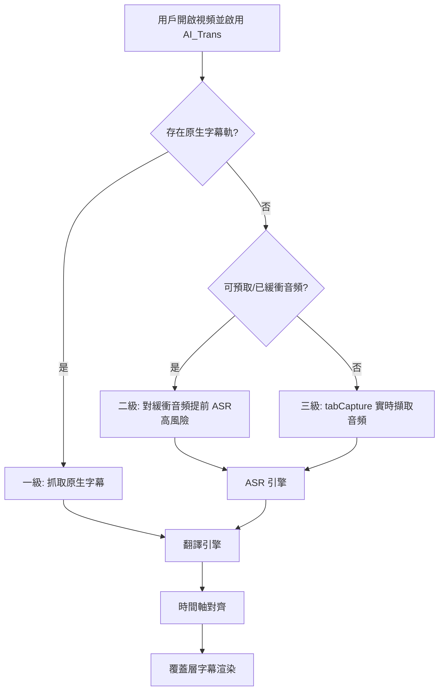
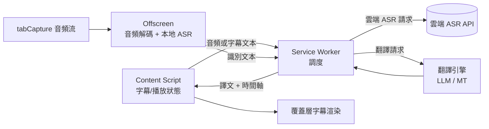

# AI_Trans 需求設計文檔

> 版本：v0.1（草案）
> 狀態：需求與可行性方案討論結論
> 最後更新：2026-08-18（**補充修復六：MV3 擴充頁面 CSP 需 `wasm-unsafe-eval`**：jsep 打包後仍「下載失敗」，Offscreen 報 `WebAssembly.instantiateStreaming() ... violates "script-src 'self'"`——MV3 擴充頁面默認 CSP 不含 wasm 編譯許可。`manifest.json` 添加 `content_security_policy.extension_pages: "script-src 'self' 'wasm-unsafe-eval'; object-src 'self';"`。先前：2026-08-18（**補充修復五：onnxruntime-web 需 jsep 變體**：wasm 本地化後仍「下載失敗」，Offscreen 報 `no available backend found ... Failed to fetch dynamically imported module: .../ort-wasm-simd-threaded.jsep.mjs`——onnxruntime-web v1.22 初始化 wasm backend 需 **jsep 變體**（`ort-wasm-simd-threaded.jsep.{mjs,wasm}`），`copy-static.mjs` 改為打包 jsep + 非 jsep 共 4 個文件。先前：2026-08-18（**補充修復四：ONNX WASM 本地化（CDN 不可達）**：模型可下載、進度 100% 後 Options 狀態卻顯示「下載失敗」。根因：transformers.js v3.8.1 默認從 `cdn.jsdelivr.net` 載入 onnxruntime wasm（模型文件下載完後創建 InferenceSession 需拉取 `.wasm`），網絡不可達 → `pipeline()` 拋錯。修復：`copy-static.mjs` 拷貝 `ort-wasm-simd-threaded.{wasm,mjs}` 到擴充 `src/runtime/ort/`，`offscreen.ts` 設置 `wasmPaths = chrome.runtime.getURL('src/runtime/ort/')`。先前：2026-08-18（**補充修復三：本地 ONNX 模型改用公開版（gated 401）**：實測下載報 `Unauthorized access to file`（HF 401）——原模型 `onnx-community/Qwen2.5-0.5B-Instruct-onnx-web` 為 gated（需登入 + Token），而 transformers.js v3.8.1 無 Token 注入機制，改用公開模型 `onnx-community/Qwen2.5-0.5B-Instruct` + `dtype: 'q4'`（INT4 `onnx/model_q4.onnx` ~350MB）。先前：2026-08-18（**新增 F-14 本地 ONNX 翻譯兜底（M2-24）**：當雲端 LLM API 失敗時自動降級至本地 ONNX 小模型（`onnx-community/Qwen2.5-0.5B-Instruct`，約 350MB）進行翻譯，實現完全離線的翻譯兜底。新增 `LocalONNXTranslationProvider` 適配器、Offscreen Document 模型下載/推理/快取管理、Options UI 模型狀態顯示與下載進度條、`TranslationConfig.fallbackType: 'local-onnx'` 配置選項。M2 範圍增列 F-14。先前：F-04 補 M1-48 LLM 直接 fetch 實裝、F-09 補 M1-49 字幕背景樣式三重對比 + 預設/自定義雙模式、F-11 補 M1-50 interceptor arraybuffer 支援 + 渲染日誌降壓。新增 F-12 調試日誌門控（M1-51，八分類中央開關，預設全關，錯誤/降級不受門控）、F-13 字幕翻譯延遲優化（M1-52，分塊翻譯 + 漸進交付 segments-ready/updated + LRU 快取 + 瞬態失敗重試 + 超時覆蓋 body 讀取；**M1-53 兩階段超時**——headers `timeoutMs` 30s + body `BODY_TIMEOUT_MS` 300s，修復本地 LLM 慢生成被 30s 誤殺全片回退原文）；M1 範圍增列 F-12/F-13。先前：F-01 補 YouTube pot token 防護兼容：MAIN world 攔截播放器 timedtext 響應複用；M1-43 捕獲時序修復；M1-45 攔截器 document_start MAIN world 注入 + SPA 換視頻熱重啟 + 跨視頻捕獲失效校驗；M1-46 攔截器重播 lastCapture（1.5s）修復「捕獲早於 bridge 監聽器註冊」競態 + 放寬 timedtext hostname 匹配 + 調試輔助；F-11 範圍擴展：外部接口調用節點診斷全掃描）））））

---

## 1. 項目概述

### 1.1 產品定位

AI_Trans 是一款 **Chrome 瀏覽器擴充（Manifest V3）**，為在線視頻提供**實時翻譯字幕**能力。首期聚焦 **YouTube**，後續可擴展到其他在線學習平台與通用網站。

### 1.2 核心價值

- 觀看外語視頻時，實時獲得母語字幕，無需離開播放頁面。
- 翻譯與語音識別（ASR）引擎**可配置**，同時支持**雲端 API** 與**本地模型**，兼顧效果與隱私。
- 通過**三級字幕獲取策略**，最大化覆蓋各種視頻場景（有原生字幕 / 無字幕但可預緩衝 / 完全無字幕）。

### 1.3 目標用戶

- 通過 YouTube、在線課程學習外語內容的學習者。
- 需要觀看外語技術/知識視頻的專業人士。
- 對數據隱私敏感、希望使用本地模型的用戶。

### 1.4 技術基調

| 維度 | 選型 |
|---|---|
| 產品形態 | Chrome MV3 擴充 |
| 首期平台 | YouTube |
| 翻譯引擎 | 混合方案（LLM 為主 + 傳統 MT 兜底），雲端/本地可配置 |
| ASR 引擎 | 本地 Whisper（WASM/WebGPU）+ 雲端 ASR API，可配置 |
| 字幕展示 | 覆蓋層字幕（Overlay） |
| 語言支持 | 多語言 |

---

## 2. 需求說明

### 2.1 功能需求

| 編號 | 功能 | 描述 | 優先級 |
|---|---|---|---|
| F-01 | 原生字幕翻譯 | 檢測並抓取 YouTube 原生字幕軌，翻譯後以覆蓋層顯示。**pot token 防護兼容（M1-42）**：真實 YouTube 對 `/api/timedtext` 引入 `pot`（proof-of-origin token）防護後，content-script（isolated world）直接用無 pot 的 `captionTracks[].baseUrl` fetch 一律返回空 body（HTTP 200 + text/html），M1-40 的格式兼容被誤判為「HTML 錯誤頁」。方案：向 MAIN world 注入 `yt-timedtext-interceptor` hook 播放器 `XMLHttpRequest`（**M1-43 補 `window.fetch` 雙 hook**），捕獲播放器**已成功**（含 pot、已過驗證）的 timedtext 響應，經 `window.postMessage` 橋回 content-script（`timedtext-bridge`），`FetchCaptionSource` 優先複用捕獲響應（解析 srv3/json3），無捕獲/解析失敗時回退直接 fetch。**M1-43 時序修復**：攔截器在 content-script `start()` 第一行注入（早於播放器就緒，不漏早期請求）；`fetchTracks` 有 15s 等待捕獲窗口（`waitForCapture`），播放器請求在前仍能複用；restart 熱重啟走 `stop()` 保留捕獲緩存。**M1-45 注入時序終極修復**：content-script `run_at: document_idle` 導致整段 content-script 在頁面加載完成後才運行，帶緩存二次加載/SPA 導航時播放器 timedtext 請求早於攔截器裝好（`waitForCapture(15s)` 超時 → 回退直接 fetch → 空 body → 永久失敗）；改為 manifest 直接聲明 `world: "MAIN"` + `run_at: "document_start"` 的 content_scripts 條目注入攔截器（頁面最早階段 hook 就位），保留動態注入作兜底（`INSTALL_FLAG` 冪等共用）。**M1-45 SPA 換視頻**：YouTube 換視頻是 pushState（SPA），content-script 不重載——監聽 `popstate` + patch `history.pushState/replaceState` 偵測 URL `v` 變化後熱重啟字幕管線。**M1-45 跨視頻捕獲失效**：捕獲帶 `videoId`（從 timedtext URL 提取），`waitForCapture(expectedVideoId)`/`tryReuseCapture` 校驗捕獲屬於當前視頻，stale 跳過留診斷。**M1-46 攔截器重播**：M1-45 的 document_start 注入引入新競態——攔截器捕獲後 postMessage，但 bridge 監聽器在 content-script（document_idle）才註冊，帶緩存二次加載時播放器請求在 document_idle 前發出、捕獲消息發在監聽器就位之前而永久丟失（連首次都失敗）；修復為攔截器維護 `lastCapture` 並以 1.5s 定時器周期重播，晚註冊的監聽器最遲 1.5s 內收到；並放寬 `isTimedText` 只匹配 pathname（不限 hostname），暴露 `__aiTransTimedtextRequests`/`__aiTransTimedtextLastCapture` 調試輔助。繞過 pot 生成——不重新請求，直接使用播放器響應 | P0 |
| F-02 | 覆蓋層字幕渲染 | 在播放器上方渲染字幕，支持單語/雙語（原文+譯文） | P0 |
| F-03 | 播放狀態同步 | 字幕隨播放進度、暫停、快進、倍速同步 | P0 |
| F-04 | 翻譯引擎配置 | 用戶可選擇雲端 LLM / 本地模型，並填寫端點與密鑰（Options 頁詳配 + Popup 快捷開關；密鑰以獨立安全存儲，不明文入配置）。端點兼容「Base URL（如 `/v1`）」與「完整 `/chat/completions` 路徑」兩種填法；配置變更經 `chrome.storage.onChanged` 跨上下文熱重啟生效（見 F-10）。**實裝（M1-48）**：LLM 翻譯改為 content script 直接 `fetch`（移除 service worker 代理與 `alarms` keepalive），解決 MV3 SW 掛起導致的消息投遞延遲 138s+ 問題——SW 精簡為僅 `config:get`/`config:set` 配置管理 | P0 |
| F-05 | 目標語言選擇 | 用戶指定目標語言（多語言支持） | P0 |
| F-06 | 實時擷取 ASR | 對無字幕視頻，擷取標籤頁音頻做實時 ASR + 翻譯。**M2 四階段實裝**：**(1) 基礎設施**——Offscreen Document（`src/runtime/offscreen.ts`）承載音頻解碼與 ASR 推理（SW 無法處理音頻/長計算）；`TabCaptureAudioSource`（`src/adapters/audio/tab-capture-source.ts`）通過 `chrome.tabCapture.getMediaStream` 獲取標籤頁音頻 → AudioContext 解碼 → AudioChunk 推送；content-script 與 Offscreen 用 `chrome.runtime.connect` port 長連接通信（避免 SW 掛起問題，M1-48 教訓）；tabCapture 用戶授權流程（Popup「啟用 ASR」按鈕觸發授權 → `chrome.storage.local` 記錄授權狀態 → content-script 監聽變更設 `enableAsr=true`）。**(2) ASR 引擎**——本地 Whisper（`@huggingface/transformers`，WASM/WebGPU，Offscreen 內推理，支持 tiny/base/small 三檔 + 自定義模型路徑如 vibevoice）；雲端 ASR 雙實現（OpenAI Whisper API `POST /v1/audio/transcriptions` multipart + Deepgram WebSocket `wss://api.deepgram.com/v1/listen` 流式 provisional）；VAD 能量閾值靜音切分（`EnergyVAD`，可配置閾值）。**(3) 策略實裝**——`RealtimeASRStrategy.run()`：TabCaptureAudioSource → VAD 過濾 → ASRPipeline.transcribeStream → provisional emit `segments-updated` → final emit `segments-ready` → 翻譯管線。**(4) 性能觀測**——`PerfMetrics` 收集 RTF/P50/P95 延遲；動態降檔（RTF>1 持續 → 降 tiny → 仍不達標 → 切雲端） | P1 |
| F-07 | ASR 引擎配置 | 用戶可選擇本地 Whisper / 雲端 ASR API。**Options 頁已有 UI**（引擎類型下拉 + 模型檔位 + 雲端端點 + API Key 安全存儲）；**M2 新增**：模型管理區（下載/刪除本地 Whisper 模型 + 進度條 + IndexedDB 存儲、自定義模型路徑如 vibevoice）；雲端 ASR 端點自動識別（Deepgram endpoint → WebSocket 流式；其他 → OpenAI 兼容 multipart） | P1 |
| F-08 | 預緩衝提前處理 | 對無字幕但可預取音頻的視頻，提前 ASR+翻譯（**高風險**） | P2 |
| F-09 | 字幕樣式設置 | 字號、顏色、位置、背景透明度等。**實裝（M1-49）**：默認樣式改為「白字 + 黑色環繞描邊 + 灰黑半透明背景」三重對比保障（極亮/極暗視頻均清晰）；Options 背景設置改為「預設下拉 + 自定義（顏色 + 透明度滑桿）」雙模式，舊配置 `transparent` 向後兼容自動映射 | P2 |
| F-10 | 本地 LLM 服務兼容 | 兼容本地 OpenAI 兼容服務（如 mlx/omlx/LM Studio/Ollama）：端點自動規範化（Base URL 或完整路徑均可）；`http://127.0.0.1/*` 與 `http://localhost/*` 主機權限；reasoning 模型的 `<think>` 思考塊剝離；長思考請求超時（默認 30s）後降級兜底；配置變更跨上下文熱重啟 | P0 |
| F-11 | 翻譯失敗診斷可見性 | 翻譯降級/錯誤不再被管線無聲吞掉：content-script 記錄最近一次失敗原因（`lastDiagnostic`，含時間戳）至 `chrome.storage.local` 並打 `console.warn` 麵包屑；**「字幕軌抓不到」與「翻譯失敗」均可診斷**——策略鏈全鏈無接管時發 `pipeline-error`（含各策略軟失敗原因）；Popup **常駐顯示**「最近失敗」行（無記錄顯示「無」），並提供**「測試連接」按鈕**——一鍵向配置端點發最小請求，驗證端點可達/模型存在/響應有效，讓用戶/開發者能直接定位「字幕沒出來」的原因（端點/模型名/CORS/字幕軌）。**外部接口調用節點診斷全掃描（M1-41）**：全部外部接口調用節點失敗都留下證據化診斷——LLM 響應非 JSON/choices 缺失不再靜默回退原文、timedtext 拉取攜帶 HTTP status/content-type/body 片段、播放器超時發 `player-not-found`、popup/options/service-worker storage 失敗可見、message-bus 異常留痕。**M1-44 細化**：LLM body 讀取失敗與 JSON 解析失敗必須區分——`Failed to fetch`（連接中斷）報「connection lost」而非誤報「not valid JSON」。**M1-50 細化**：interceptor 支援 `arraybuffer` responseType（`TextDecoder` 解碼），避免二進制傳輸的 timedtext 響應被誤判為空；XHR onLoad 記錄 `status`/`responseType` 使空響應可區分為 HTTP 錯誤/類型不支援/真實無字幕；併 overlay 渲染日誌降壓（每幀洪水 → 條件/節流記錄） | P0 |
| F-12 | 調試日誌門控（M1-51） | 流程診斷日誌（render/draw/fetch/capture 等）在真實環境每幀/每塊輸出會淹沒控制台、對普通用戶無意義。提供**中央分類門控**：八分類（`overlay`/`llm`/`capture`/`pipeline`/`strategy`/`content`/`bridge`/`interceptor`）各一開關，預設**全關**（`DEBUG_LOG_OFF`），Options 頁「調試日誌」分區逐類 checkbox 開啟；開關持久化（`EngineConfig.debugLog`）、跨上下文與跨 world 同步（content-script 經 `CustomEvent` 中繼給 MAIN world 攔截器）。**錯誤與降級信息（console.warn + `recordDiagnostic`）始終可見、不受開關影響**（§5.6 不靜默紅線）——門控只針對流程診斷（`console.log`），不掩蓋失敗痕跡 | P1 |
| F-13 | 字幕翻譯延遲優化（M1-52） | 長視頻（數百段字幕）不再「整片翻譯完才顯示」——**分塊翻譯**（每 15 段一塊逐塊請求，M1-55 從 60 降至 15 避免 LLM 輸出截斷/重複）+ **漸進交付**（首塊譯完即顯示 `segments-ready`，後續塊 `segments-updated` 增量替換，5-10s 內先見首屏）+ **LRU 快取**（相同視頻/語言/模型重播免請求，100 條上限，配置變更全量失效）+ **瞬態失敗重試**（網絡抖動/429/5xx 自動重試 ≤2 次退避，單塊失敗僅該塊原文兜底、不阻塞其餘塊）+ **請求超時覆蓋響應 body 讀取全程**（避免本地服務發完響應頭後 body 掛死導致字幕永久卡住）。**M1-53 兩階段超時**：超時拆分為 headers 階段（`timeoutMs` 默認 30s，抓 connection lost）與 body 階段（`bodyTimeoutMs` 默認 `BODY_TIMEOUT_MS=300_000`，5min，本地 LLM 長輸出窗口）——修復本地服務 11ms 回 headers 但 body 生成 >30s 被單一 30s 超時誤殺、全片回退原文的問題。**M1-55 不完整/重複診斷**：請求 body 明確設置 `max_tokens: 4096`（避免服務端默認限制截斷輸出）；LLM 輸出行數少於輸入段數時輸出 incomplete 警告，相同翻譯出現在多個 index 時輸出 duplicate 警告（§5.6 不靜默），讓用戶能定位截斷/重複問題而非誤判為翻譯邏輯錯誤；Prompt 改用 few-shot 示例格式（小模型對示例遵循度遠高於文字說明） | P1 |
| F-14 | 本地 ONNX 翻譯兜底（M2-24） | 當雲端 LLM API 失敗（網絡錯誤/配額耗盡/離線）時，自動降級至本地 ONNX 小模型進行翻譯，實現完全離線的翻譯兜底。**模型**：`onnx-community/Qwen2.5-0.5B-Instruct`（INT4 ONNX，`dtype: 'q4'` 下載 `onnx/model_q4.onnx`，約 350MB），平衡翻譯質量與瀏覽器記憶體限制。**架構**：新增 `LocalONNXTranslationProvider` 適配器（實作 `TranslationProvider` 端口），透過 Chrome Message Bus 發送推理請求給 Service Worker，Service Worker 轉發給 Offscreen Document（具備完整 DOM 與 WASM 支援）執行 ONNX Runtime Web 推理。**WASM 本地化**：transformers.js v3 默認從 jsdelivr CDN 載入 wasm（CDN 不可達時下載完成後初始化失敗），`copy-static.mjs` 將 `ort-wasm-simd-threaded.{wasm,mjs}` 及 jsep 變體打包進擴充並以 `wasmPaths` 指向本地，`manifest.json` 的 `extension_pages` CSP 含 `'wasm-unsafe-eval'`（MV3 默認 CSP 會攔截 WebAssembly 編譯），推理自包含不依賴外部 CDN。**Options UI**：新增「本地兜底模型」分區，包含：(1) 唯讀模型名稱欄位；(2) 模型狀態標籤（`未下載`/`下載中 xx%`/`已就緒`/`下載失敗`）；(3) 下載進度條（實時顯示位元組下載百分比與速度）；(4) 「下載模型」與「清除快取」按鈕。**降級鏈路**：`TranslationConfig.fallbackType` 新增 `'local-onnx'` 選項，`Orchestrator` 組裝 `TranslationPipeline` 時優先選擇 `local-onnx` 作為 fallback（`local-onnx > mt > undefined`）。若模型尚未下載，拋出錯誤並記錄 `local-onnx-not-downloaded` 診斷，管線繼續降級至 MT 或原文 | P1 |

### 2.2 非功能需求

| 維度 | 要求 |
|---|---|
| 延遲 | 一級（原生字幕）翻譯延遲應接近即時；三級（實時 ASR）端到端延遲控制在可接受範圍（數百 ms ~ 數秒） |
| 準確率 | 譯文語義準確、通順；ASR 識別在清晰音頻下有可用準確率 |
| 穩定性 | YouTube 頁面改版時應有降級策略，避免整體崩潰 |
| 隱私 | 本地模式下音頻與文本不出設備；雲端模式下明確告知數據流向 |
| 性能 | 本地推理不應嚴重卡頓頁面；提供性能與效果的權衡選項 |
| 兼容性 | 支持主流 Chromium 內核瀏覽器（Chrome / Edge） |

---

## 3. 核心業務流程

### 3.1 三級字幕獲取策略

系統按以下優先級決策字幕來源，逐級降級：

1. **一級 — 原生字幕**：視頻存在原生字幕軌 → 直接抓取 → 翻譯 → 覆蓋顯示。
2. **二級 — 預緩衝提前處理**：無原生字幕，但視頻已預緩衝/可預取音頻 → 提前對已緩衝音頻做 ASR + 翻譯 → 播放時實時顯示。
3. **三級 — 實時擷取**：無原生字幕且無可用預緩衝 → 從標籤頁實時擷取音頻 → 實時 ASR + 翻譯 → 顯示。

### 3.2 決策流程圖



### 3.3 落地順序建議

雖然三級策略全部納入設計，但基於技術風險，建議實現順序為：

**一級（風險低，先落地） → 三級（覆蓋無字幕場景） → 二級（高風險，作為優化）**

理由：二級與三級共用「ASR + 翻譯 + 對齊 + 渲染」管線，差異僅在音頻數據來源。先打通三級的實時管線，二級即可在其基礎上做「數據來源前置」優化。

---

## 4. 系統架構

### 4.1 MV3 組件劃分

| 組件 | 職責 |
|---|---|
| **Service Worker（背景）** | 全局調度、配置管理、雲端 API 代理、跨組件消息路由。注意 MV3 SW 為事件驅動、可能被回收，不做長任務。 |
| **Content Script（內容腳本）** | 注入 YouTube 頁面：抓取原生字幕軌、監聽播放狀態（進度/暫停/倍速）、渲染覆蓋層字幕、注入頁面級 hook。 |
| **Offscreen Document（離屏文檔）** | 承載音頻解碼與**本地 Whisper 推理**等重任務（MV3 中 SW 無法直接處理音頻/長時計算，需離屏文檔）。 |
| **Options / Popup（配置界面）** | 引擎選擇、API Key/端點填寫、語言與字幕樣式設置。 |

### 4.2 數據流



### 4.3 通信機制

- Content Script ↔ Service Worker：`chrome.runtime.sendMessage` / 長連接 `Port`。
- Service Worker ↔ Offscreen：`chrome.runtime` 消息 + `chrome.offscreen` API 管理生命週期。
- 音頻大數據傳輸：優先在 Offscreen 內處理，避免跨組件序列化大 buffer。

---

## 5. 關鍵技術可行性分析

### 5.1 一級：原生字幕抓取（風險低）

- **方案**：檢測 YouTube 字幕軌（`timedtext` 接口 / 播放器字幕列表），拉取字幕（含時間軸），送翻譯引擎，覆蓋顯示。
- **可行性**：高。字幕含精確時間軸，翻譯後對齊簡單，延遲低。
- **風險**：YouTube 接口/參數可能變更；部分視頻僅有自動生成字幕（質量參差）。
- **應對**：抽象字幕抓取層，接口變更時可快速適配；對自動字幕做標記提示。

### 5.2 二級：預緩衝提前處理（高風險）

- **方案**：YouTube 採用 MSE + 分片自適應流（DASH），音頻軌通過帶簽名參數的 URL 分片下發。理論上可預取已緩衝/後續音頻分片，提前解碼並做 look-ahead ASR。
- **可行性**：技術上可行，但**脆弱**。
- **風險（高）**：
  - 依賴 YouTube 內部接口與簽名機制，易隨改版失效。
  - 分片解碼、拼接、時間軸還原複雜。
  - 可能觸及平台使用條款邊界。
- **應對**：
  - 標記為**高風險優化項**，非 MVP 必需。
  - 與三級共用 ASR+翻譯管線，僅替換「音頻數據來源」。
  - 失效時自動降級到三級實時擷取。

### 5.3 三級：實時擷取 ASR

- **方案**：`chrome.tabCapture` 獲取標籤頁音頻流 → Offscreen 解碼 → 分段送 ASR（本地 Whisper 或雲端 API）→ 翻譯 → 覆蓋顯示。
- **可行性**：可行，是「無字幕」場景的通用兜底。
- **風險**：
  - 實時 ASR 有固有延遲（分段等待 + 推理時間）。
  - 本地 Whisper 在瀏覽器（WASM/WebGPU）對機器性能要求高，低端設備可能卡頓。
  - `tabCapture` 需用戶手勢觸發並授權。
- **應對**：
  - 提供「模型大小/精度」與「延遲」的權衡選項（如 tiny/base/small）。
  - 雲端 ASR 作為性能不足時的替代。
  - 合理的分段策略（VAD 靜音切分）降低延遲與碎片。

---

## 6. 模塊設計

### 6.1 字幕抓取模塊（Caption Fetcher）

- 分級策略器：按 3.1 順序決策來源，逐級降級。
- YouTube 字幕軌解析器：解析字幕列表、拉取指定語言軌、提取時間軸。
- 統一輸出格式：`{ start, end, text }[]`。

### 6.2 ASR 模塊（統一接口）

```
interface ASREngine {
  transcribe(audioChunk, options): Promise<{ start, end, text }[]>
}
```

- 本地實現：Whisper（WASM / WebGPU），運行於 Offscreen。
- 雲端實現：ASR API 適配器（如 Whisper API / Deepgram 等）。
- VAD 分段：基於靜音檢測切分音頻，平衡延遲與準確度。

### 6.3 翻譯模塊（統一接口）

```
interface TranslationEngine {
  translate(segments, targetLang, options): Promise<string[]>
}
```

- 混合策略：**LLM 為主**（語義好、可帶上下文），**傳統 MT 兜底**（LLM 不可用/超額/超時時降級）。
- 雲端/本地可配置：雲端 LLM API、本地模型端點均通過適配器接入。
- 批量與上下文：支持按句/按段批量翻譯，攜帶前後文提升連貫性。

### 6.4 渲染模塊（Overlay Renderer）

- 覆蓋層 DOM 注入播放器容器，隨全屏/窗口變化自適應。
- 時間軸對齊：依據播放進度顯示對應字幕；支持倍速、快進、暫停。
- 顯示模式：單語（譯文）/ 雙語（原文 + 譯文）。
- 樣式可配置：字號、顏色、位置、背景。

### 6.5 配置模塊（Settings）

- 引擎切換（翻譯 / ASR：雲端 vs 本地）。
- 端點與密鑰管理。
- 語言對、字幕樣式、性能檔位。
- 存儲於 `chrome.storage`（敏感信息本地存儲，明確不上傳）。

---

## 7. 配置系統設計

### 7.1 引擎抽象接口

所有翻譯與 ASR 引擎通過統一適配器接入，屏蔽雲端/本地差異：

- **翻譯適配器**：輸入標準化 segments 與目標語言，輸出譯文數組。內部處理各家 API 的請求格式、鑑權、重試、降級。
- **ASR 適配器**：輸入音頻分段，輸出帶時間軸的識別文本。本地實現走 Offscreen 推理，雲端實現走 SW 代理請求。

### 7.2 配置項

| 配置項 | 說明 | 取值示例 |
|---|---|---|
| 翻譯引擎類型 | 雲端 LLM / 本地模型 / 傳統 MT | cloud-llm / local / mt |
| 翻譯模型 | 具體模型標識 | 由用戶填寫 |
| 翻譯端點 | API Base URL 或完整 `/chat/completions` 路徑（自動規範化，見 F-10） | `http://127.0.0.1:8000/v1` 或 `https://.../v1/chat/completions` |
| 翻譯密鑰 | API Key | 本地存儲 |
| 翻譯請求超時 | LLM 請求超時（默認 30s，provider 級默認值，暫未暴露 UI），reasoning 模型長思考超時後自動降級 MT 兜底 | 30000 |
| ASR 引擎類型 | 本地 Whisper / 雲端 ASR | local-whisper / cloud |
| Whisper 模型檔 | 性能/精度權衡 | tiny / base / small |
| 目標語言 | 譯文語言 | zh / en / ja ... |
| 顯示模式 | 單語 / 雙語 | mono / bilingual |
| 字幕樣式 | 字號/顏色/位置/背景 | — |

---

## 8. MVP 範圍與里程碑

| 里程碑 | 範圍 | 說明 |
|---|---|---|
| **M1 — 原生字幕翻譯** | F-01, F-02, F-03, F-04, F-05, F-10, F-11, F-12, F-13 | 一級策略：抓 YouTube 原生字幕 → 翻譯 → 覆蓋層 + 配置界面 + 本地 LLM 服務兼容 + 翻譯失敗診斷可見性 + 調試日誌門控 + 字幕翻譯延遲優化。風險低，優先交付。 |
| **M2 — 實時擷取 ASR** | F-06, F-07, F-14 | 三級策略：tabCapture 音頻 → ASR（雲端/本地可配）→ 翻譯 → 顯示。打通實時管線。新增本地 ONNX 翻譯兜底（F-14）。 |
| **M3 — 預緩衝提前處理** | F-08 | 二級策略（高風險優化）：在 M2 管線上做音頻來源前置；失效自動降級 M2。 |
| **M4 — 體驗與穩定性** | F-09 及優化 | 多語言優化、字幕樣式、性能檔位、YouTube 改版適配加固。 |

> 說明：雖然需求為「三級全做」，但落地順序按風險遞進（M1→M2→M3），確保穩妥交付。

---

## 9. 技術風險與應對

| 風險 | 影響 | 應對 |
|---|---|---|
| YouTube 接口/頁面改版 | 字幕抓取、音頻預取失效 | 抽象抓取層；監測與快速適配；降級策略 |
| 二級預緩衝方案脆弱 | 音頻分片預取不穩定 | 標記高風險；失效自動降級三級 |
| 實時 ASR 延遲 | 字幕滯後影響體驗 | VAD 分段；模型檔位權衡；雲端 ASR 備選 |
| 本地推理性能 | 低端設備卡頓 | 提供 tiny/base 檔；WebGPU 加速；降級雲端 |
| MV3 SW 回收 | 長任務中斷 | 重任務放 Offscreen；狀態持久化 |
| 密鑰安全 | 雲端密鑰洩露 | 本地存儲、不上傳；請求經 SW 代理 |
| 使用條款合規 | 音頻擷取/預取合規邊界 | 明確用途與提示；優先原生字幕方案 |

---

## 10. 開放問題與待決策項

1. **雲端 API 供應商範圍**：首期支持哪些 LLM/ASR 供應商（或僅提供通用 OpenAI 兼容端點）？
2. **本地模型分發**：Whisper WASM 模型體積較大，如何分發與加載（按需下載 / 首次初始化）？
3. **WebGPU 兼容策略**：無 WebGPU 環境是否回退純 WASM，性能檔位如何默認？
4. **傳統 MT 兜底供應商**：LLM 降級時使用哪個 MT 服務？
5. **YouTube 接口適配維護**：接口變更的監測與更新機制。
6. **多語言 UI**：配置界面本身是否需要多語言。
7. **二級可行性驗證**：是否需要先做一次技術預研（Spike）確認音頻分片預取的穩定性再排期。

---

## 附錄：術語

| 術語 | 說明 |
|---|---|
| ASR | 自動語音識別（Automatic Speech Recognition） |
| MT | 機器翻譯（Machine Translation） |
| LLM | 大語言模型 |
| MV3 | Chrome Manifest V3 擴充規範 |
| MSE / DASH | 媒體源擴展 / 動態自適應流 |
| VAD | 語音活動檢測（靜音切分） |
| Offscreen Document | MV3 中承載 DOM/重計算任務的離屏頁面 |
